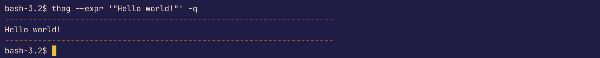
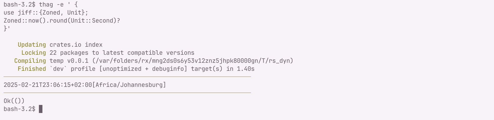
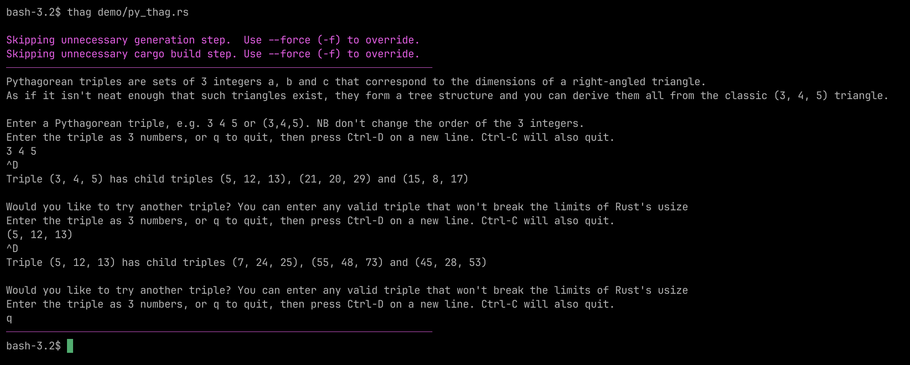
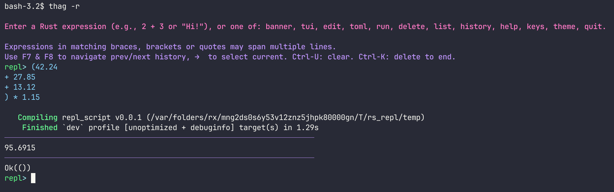
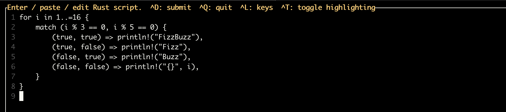
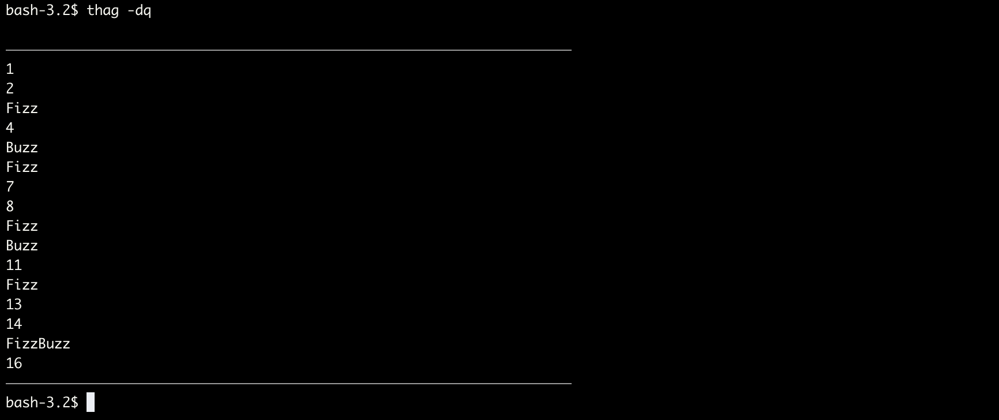
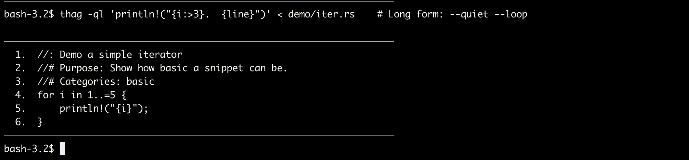
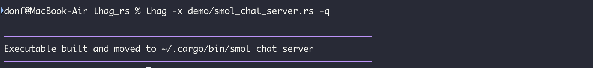
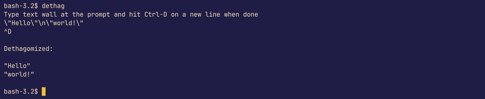
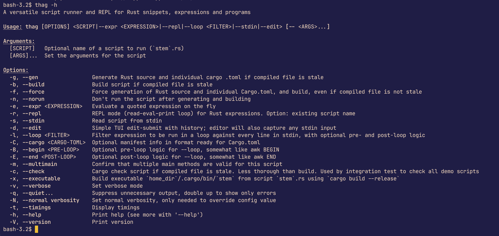

# thag_rs

[](https://crates.io/crates/thag_rs)
[](https://img.shields.io/crates/size/thag_rs)
[](https://docs.rs/\n)
[](https://github.com/durbanlegend/thag_rs/actions)

<a href="https://deps.rs/repo/github/durbanlegend/thag_rs"></a>


## Intro

`thag_rs` (command `thag`) is a versatile script runner and REPL for Rust expressions, snippets, and programs. It's a developer tool that allows you to run and test Rust code from the command line for rapid prototyping and exploration.
It aims to handle cases that are beyond the scope of the Rust playground or the average script runner, while hopefully being simple and convenient to use.
It also supports scripting via shebangs, building executables from your snippets, a loop-filter mode and plain or edited standard input.

`thag_rs` includes a demo library of over 170 sample scripts, documented in [demo/README.md](https://github.com/durbanlegend/thag_rs/blob/master/demo/README.md). If you've got something good to share, do feel free to offer it, subject to the MIT / Apache 2 licence terms.

## Quick start: ways to run the `thag` command

### * With an expression argument:

```bash
thag --expr '"Hello world!"'                                    # Short form: -e
```


Invoking quiet mode (`--quiet / -q`) suppresses most feedback except for the flowerbox to highlight the output.
Invoking it twice (`-qq` for short) suppresses all non-error feedback including the flowerbox, allowing the
output to be used as a filter.

By default, `thag` and Cargo will feed back to you:

```bash
thag -e ' {
use jiff::{Zoned, Unit};
Zoned::now().round(Unit::Second)?
}'                                                              # Long form: --expr
```


### * With a script:

Here's a sample interactive script for discovering Pythagorean triangles with integer sides:

```bash
thag demo/py_thag.rs
```


```bash
thag demo/iced_tour.rs
```
This will `cargo build` and run the tour of the `iced` cross-platform GUI library. The script is taken from the published examples in the `iced` crate.

To run the script directly, you can add a shebang of the form `#! /usr/bin/env thag` on line 1. You need to give the script execute permissions in order to run it. E.g. (*nix):

```bash
chmod ug+x demo/fib_basic.rs
demo/fib_basic.rs -- 10
```

But why build a script via a shebang each time you use it when you can simply make it a command as Rust intended? See `As an executable` below.

### * As a REPL (Read-Evaluate-Print Loop):

```bash
thag --repl                                                     # Short form: -l
```


The REPL has file-backed searchable history and access to graphical and text-based editors such as VS Code, Zed, Helix, Vim, nano etc. via the VISUAL or EDITOR environment variables, in case its `reedline` editor falls short for a particular task. The key bindings in the latter will depend on your terminal settings and you should probably not expect too much in the way of navigation shortcuts.

### * With standard input:

```bash
echo '(1..=10).product::<u32>()' | thag --stdin                 # Short form: -s
```

Place any arguments for the script after `--` to separate them from `thag` arguments:

```bash
echo 'println!("Hello {}", std::env::args().nth(1).unwrap());' | thag -s -- Ferris
```

This is equivalent to:

```bash
thag -e 'println!("Hello {}", std::env::args().nth(1).unwrap());' -- Ferris
```

### * With a TUI (Terminal User Interface) editor

```bash
thag --edit                                                     # Short form: -d
```




### * With standard input into the TUI editor:

```bash
cat my_file.rs | thag --edit                                    # Short form: -d
```

This allows you to edit or append to the stdin input before submitting it to `thag_rs`. It has file-backed history so you don't lose your edits.

#### A note on the TUI editor
In order for the Shift-Up and Shift-Down key combinations to work on Apple Terminal, you may need to add the following to your Apple Terminal Settings | Profiles | Keyboard settings:
Shift-Up: `\033;[2A` and `Shift-Down`: \033;[2B. Use the Esc key to generate \033. This is not necessary on Iterm2 or WezTerm.

In general, if you don't experience the key bindings you want, it is probably because your terminal has intercepted them and you may be able to resolve the issue by adjusting your terminal settings. The same applies to the REPL.

### * As a filter on standard input (loop mode):

At a minimum, loops though `stdin` running the `--loop` expression against every line. The line number and content are made available to the expression as `i` and `line` respectively.

```bash
cat demo/iter.rs | thag --loop 'format!("{i}.\t{line}")' -q    # Short form: -l
```


Note the use of the `--quiet (-q)` option above to suppress messages from Cargo build.

Alternatively:

```bash
thag -l 'format!("{i}.\t{line}")' < demo/hello.rs               # Long form: --loop
```
For a true filter that you can pipe to another process, you can use `-qq` (or `--quiet --quiet`) to suppress all non-error output.

Loop mode also accepts the following optional arguments supplying surrounding code, along the lines of AWK:

```bash
--cargo (-C)    for specifying dependencies etc. in Cargo.toml format.
--begin (-B)    for specifying any imports, functions/closures, declarations etc. to be run before the loop.
--end   (-E)    for specifying any summary or final logic to run after the loop.
```

Note: This is a Rust issue not a `thag_rs` issue, but in general if you are planning to pipe Rust output, it's probably a good idea to use `writeln!(io::stdout())`,
rather than `println!`, since at time of writing `println!` panics if it encounters an error, and this
includes the broken pipe error from a head command. See `https://github.com/BurntSushi/advent-of-code/issues/17`.
For an example of tolerating a broken pipe, see
demo/thag_from_rust_script.rs.

### * As an executable:
The --executable (-x) option builds your script in release mode and moves it to ~/.cargo/bin/, which is recommended to be in your path.

```bash
thag -x my_script.rs                                            # Long form: --executable
```


You can of course use an OS command to rename the executable if you so desire.


However, it's probably best to rename your source in the first place so you don't lose track of where the command came from if you want to update it.

I recommend building an executable over using a shebang because it will be faster on several counts:

- It cuts out the middleman (`thag`)
- You only incur the build overhead once up front
- It will build in release mode, making it much faster to run
- You can use a tool like `llvm-strip` to strip sections from the executable to make it smaller

and more convenient on one count: it dispenses with the need for the `--` argument separator because `thag` is no longer being invoked first, so we don't need to separate two sets of arguments.

Putting it to use:



### * Command-line options

Hopefully the help screen is self-explanatory:



You can enter `thag` arguments and options in any order, as long as you separate them from any script arguments with a `--` separator.

### * Getting started:

You have the choice of installing `thag_rs` (recommended), or you may prefer to clone it and compile it yourself and run it via `cargo run -- `.

* Installing gives you speed out of the box and a simpler command-line interface without invoking Cargo yourself. You have a choice:
```bash
cargo install thag_rs
```
or choose an appropriate installer for your environment from the Github releases page `https://github.com/durbanlegend/thag_rs/releases`, as from `v0.1.1`.

You can also download the starter kit of demo scripts as `demo.zip`
from the same page.

* Cloning gives you immediate access to the demo scripts library and the opportunity to make local changes or a fork. You can also use the flag `--features=debug-logs` with the environment variable `RUST_LOG=thag_rs=debug` to get debug logging.

## Overview

`thag_rs` uses Cargo, `syn`, `quote` and `cargo_toml` to analyse and wrap well-formed snippets and expressions into working programs. Well-formed input programs are identified by having a valid `fn main` (or more than one - see below) and passed unchanged to `cargo build`.

`thag_rs` uses `syn` to parse valid code into an abstract syntax tree (AST). Among other benefits this prevents it being fooled by code embedded in comments or string literals, which is the curse of regular expressions and string parsing. `thag_rs` then uses the `syn` visitor mechanism to traverse the AST to identify dependencies in the code so as to generate a `Cargo.toml`. It filters these to remove duplicates and false positives such as built-in Rust crates, renamed crates and local modules.

Well-formedness is determined by counting any occurrences of a `main` function in the AST. The lack of a `fn main` signifies a snippet or expression, whereas more than one `fn main` is sometimes valid but must be actively flagged as such by the user with the `--multimain (-m)` option.

If your code does not successfully parse into an AST because of a coding error, `thag_rs` will fall back to using source code analysis to prepare your code for the Rust compiler, which can then show you error messages to help you find the issues.

You may provide optional valid (Cargo.toml) metadata in a toml block as described below. `thag_rs` uses `cargo_toml` to parse any metadata into a manifest struct, merges in any dependencies, features or patches inferred from the AST, and then uses `toml` to write out the dedicated Cargo.toml file that Cargo needs to build the script. Finally, in the case of snippets and expressions, it uses `quote` to embed the logic in a well-formed program template and `prettyplease` to format it, and finally invokes Cargo to build it.

All of this happens quite fast: the real bottleneck will be the familiar Cargo build process downloading and compiling your dependencies on the initial build. Cargo build output will be displayed in real time by default so that there are no mystery delays. If you rerun the compiled script it should be lightning fast.

In this way `thag_rs` attempts to handle any valid (or invalid) Rust script, be it a program, snippet or expression. It will try to generate a dedicated Cargo.toml for your script from `use` statements in your code, although for speed and precision I recommend that you embed your own in a toml block:
```/*
[toml]
[dependencies]
...
*/
```
at the start of the script, as you will see done in most of the demos. To help with this, after each successful Cargo search `thag_rs `will generate and print a basic toml block with the crate name and version under a `[dependencies]` header, for you to copy and paste into your script if you want to. (As in the second `--expr` example above.) It does not print a combined block, so it's up to you to merge all the dependencies into a single toml block. All dependencies can typically go under the single `[dependencies]` header in the toml block, but thanks to `cargo_toml` there is no specific limit on what valid Cargo code you can place in the toml block.

`thag_rs` aims to be as comprehensive as possible without sacrificing speed and transparency. It uses timestamps to rerun compiled scripts without unnecessary rebuilding, although you can override this behaviour. For example, a precompiled script will calculate the 35,661-digit factorial of 10,000 in under half a second on my M1 MacBook Air.

### Example of using a toml block (`demo/prettyplease.rs`)

    /*[toml]
    [dependencies]
    prettyplease = "0.2.20"
    syn = { version = "2", default-features = false, features = ["full", "parsing"] }
    */

    /// Published example from `prettyplease` Readme.
    //# Purpose: Demo featured crate.
    const INPUT: &str = stringify! {
        use crate::{
              lazy::{Lazy, SyncLazy, SyncOnceCell}, panic,
            sync::{ atomic::{AtomicUsize, Ordering::SeqCst},
                mpsc::channel, Mutex, },
          thread,
        };
        impl<T, U> Into<U> for T where U: From<T> {
            fn into(self) -> U { U::from(self) }
        }
    };

    fn main() {
        let syntax_tree = syn::parse_file(INPUT).unwrap();
        let formatted = prettyplease::unparse(&syntax_tree);
        print!("{}", formatted);
    }

## Installation

### Minimum Supported Rust Version
The minimum supported Rust version (MSRV) for `thag_rs` is 1.74.1.

You can install `thag_rs` using `cargo install`:

```bash
cargo install thag_rs
```
### Downloading the starter kit (demo directory)
As from `v0.1.1` you can download `demo.zip` from `https://github.com/durbanlegend/thag_rs/releases`.

Note that you can also link to individual demo files via their links in `demo/README.md` and manually download the file from the download icon provided.
As a matter of interest, the `rs_thag` demo file [download_demo_dir.rs](https://github.com/durbanlegend/thag_rs/blob/master/download_demo_dir.rs) can download the whole demo directory from Github.
Click on its link above and from the icons provided by Github you can download it and run it as `thag <dir_path>/download_demo_dir.rs`, or just copy it and paste it into the `thag -d` editor and choose Ctrl-d to run it. It should download the entire demo directory from the repo to the directory you choose. Thag pull self up by own sandal straps. Thag eating own dog food! Thag like dog food.

## Usage
Once installed, you can use the `thag` command from the command line. `thag` uses `clap` to process command-line arguments including `--help`.

Here are some examples:

### Evaluating an expression
#### Concise fast factorial calculation

```bash
thag -e '(1..=34).product::<u128>()'
```
This panics beyond 34! due to using Rust primitives, but see `demo/factorial_dashu_product.rs` for arbitrarily big numbers:

#### Shoehorn a script into an expression, just because!
```bash
thag -e "$(cat demo/fizz_buzz_gpt.rs)"
```
The `--expr` flag will not only evaluate an expression, it will also accept a valid Rust program or set of statements.
The different ways `thag` accepts code are as far as possible "orthagonal" to the common way it processes them.

#### Run a script in quiet mode but show timings
```bash
thag -tq demo/fizz_buzz_gpt.rs
Completed generation in 0.276s
Completed build in 1.171s
----------------------------------------------------------------------
1
2
Fizz
4
Buzz
Fizz
7
8
Fizz
Buzz
11
Fizz
13
14
FizzBuzz
16
...
89
FizzBuzz
91
92
Fizz
94
Buzz
Fizz
97
98
Fizz
Buzz
----------------------------------------------------------------------
Completed run in 0.558s
thag_rs completed processing script fizz_buzz_gpt.rs in 2.43s
```

### Using the REPL
```bash
thag -r
```
This will start an interactive REPL session where you can enter or paste in a single- or multi-line Rust expression and press Enter to run it. You can also retrieve and optionally edit an expression from history.
Having evaluated the expression you may choose to edit it, and / or the generated Cargo.toml, in your preferred editor (VS Code, Helix, Zed, nano...) and rerun it. The REPL also offers basic housekeeping functions for the temporary files generated, otherwise being in temporary space they will be cleaned up by the operating system in due course.

#### Revisiting a REPL expression from a previous session
```bash
thag -r repl_<nnnnnn>.rs
```
will return to edit and run a named generated script from a previous REPL session.

More informally, you can access the last 25 REPL commands or expressions from within the REPL function just by using the up and down arrow keys to navigate history.

#### General notes on REPL
All REPL files are created under the `rs_repl` subdirectory of your temporary directory (e.g. $TMPDIR in *nixes, and referenced as std::env::temp_dir() in Rust) so as not to clog up your system. Until such time as they are harvested by the OS you can display the locations and copy the files if desired.

The REPL feature is not suited to scripts of over about 1K characters, due to the limitations of the underlying line editor. You can overcome these limitations by using the REPL's `edit` mode instead, but by this point it's probably more convenient just to use `--stdin / -s` or `--edit / -d` instead of the REPL, or save the source in a .rs file and run it from the command line.

## Features

_Rust is primarily an expression language.... In contrast, statements serve mostly to contain and explicitly sequence expression evaluation._
_— The Rust Reference_

* Runs serious Rust scripts (not just the "Hello, world!" variety) with no need to create a project.
* Aims to be the most capable and reliable script runner for Rust code.
* A choice of modes - bearing in mind the importance of expressions in Rust:
    * expression mode for small, basic expressions on the fly.
    * REPL mode offers interactivity, and accepts multi-line expressions since it uses bracket matching to wait for closing braces, brackets, parens and quotes.
    * stdin mode accepts larger scripts or programs on the fly, as typed, pasted or piped input.
    * edit mode is stdin mode with the addition of basic TUI (terminal user interface) in-place editing, with or without piped input.
    * the classic script mode runs an .rs file consisting of a valid Rust snippet or program.
* You can use a shebang to write scripts in Rust.
* For more speed and a seamless experience you can build your own commands, using the `--executable` (`-x`) option. This will compile a valid script to a release-optimised executable command in the Cargo bin directory `<home>/.cargo/bin`.
* `thag_rs` supports a personal library of code samples for reuse. The downloadable starter set in the demo subdirectory includes numerous examples from popular crates, as well as original examples including fast big-integer factorial and Fibonacci calculation and prototypes of TUI editing and of the adaptive colour palettes described below.
* Any valid valid Cargo.toml input may be specified in the toml block, e.g.:
- Specific features of dependencies for advanced functionality
- Local path and git dependencies
- A [profile.dev] with a non-default optimisation level
- A [[bin]] to rename the executable output.
* Automatic support for light or dark backgrounds and a 16- or 256- colour palette for different message types, according to terminal capability. Alternatively, you can specify your terminal preferences in a `config.toml` file. On Windows, interrogating the terminal is not well supported and tends to cause interference, so in the absence of a `config.toml` file, `thag_rs` defaults to basic ANSI-16 colours and dark mode support. However, the dark mode colours it uses have been chosen to work well with most light modes.
* In some cases you may be able to develop a module of a project individually by giving it its own main method and embedded Cargo dependencies and running it from thag_rs. Failing that, you can always work on a minimally modified copy in another location. This approach allows you to develop and debug a new module without having it break your project. For example the demo versions of colors.rs and stdin.rs were both prototypes that were fully developed as scripts before being merged into the main `thag_rs` project.

## Platform Support
This crate is designed to be cross-platform and supports MacOS, Linux and Windows.

Currently tested on MacOS (M1) Sonoma, Zorin and (WSL2) Ubuntu, and Windows 11 PowerShell 5, CMD under Windows Terminal and Windows Console, and WSL2.

GitHub Actions test each commit on `ubuntu-latest`, `macos-latest` and `windows-latest`.

## Why "thag"?

After the late Thag Simmons. A stone-age power tool for the grug brained developer to beat Rust code into submission. Why type long name when short sharp name do trick?

## Related projects

(Hat-tip to the author of `rust-script`)

* `cargo-script` - The Rust RFC Book `https://rust-lang.github.io/rfcs/3424-cargo-script.html`
* `evcxr` - Perhaps the most well-known Rust REPL.
* `cargo-script` - (Unrelated to the Rust RFC one). Rust script runner (unmaintained project).
* `rust-script` - maintained fork of the preceding cargo-script.
* `cargo-eval` - maintained fork of the preceding cargo-script.
* `cargo-play` - local Rust playground.
* `irust` - limited Rust REPL.
* `runner` - experimental tool for running Rust snippets without Cargo, exploring dynamic vs static linking for speed. I have an extensively modified fork of this crate on GitHub, but I highly recommend using the current `thag_rs` crate rather than that fork.
* `cargo-script-mvs` - RFC demo.

There is more discussion of prior art at the Rust RFC link.

## License

SPDX-License-Identifier: Apache-2.0 OR MIT

Licensed under either of

    Apache License, Version 2.0 (LICENSE-APACHE or http://www.apache.org/licenses/LICENSE-2.0)

or

    MIT license (LICENSE-MIT or http://opensource.org/licenses/MIT)

at your option.

## Contributing

Contributions will be considered if they fit the goals of the project.

Unless you explicitly state otherwise, any contribution intentionally submitted for inclusion in the work by you will be dual-licensed as above, without any additional terms or conditions.
