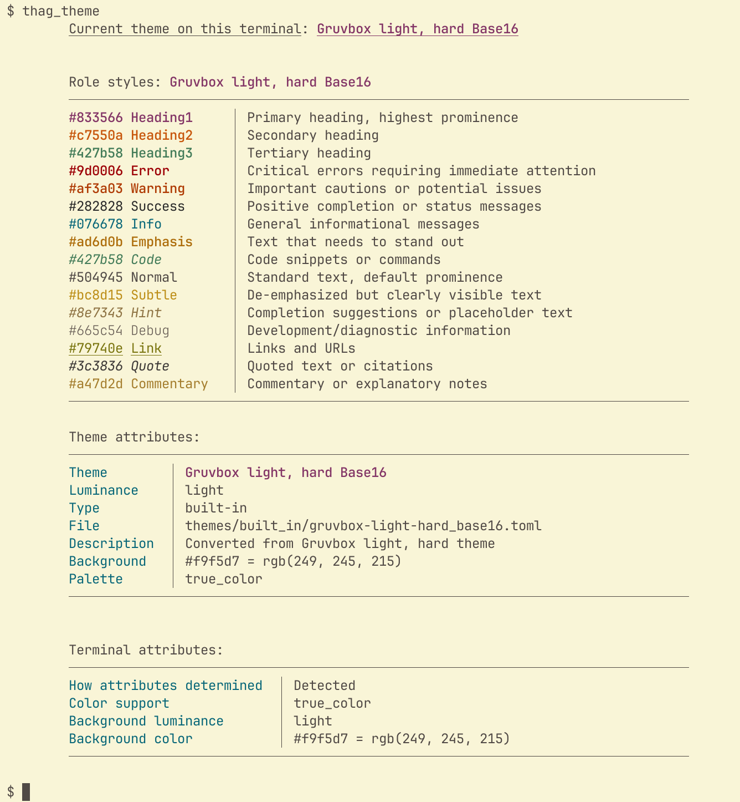
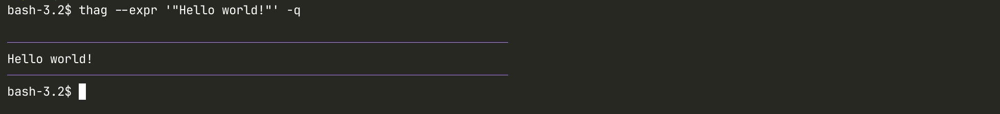
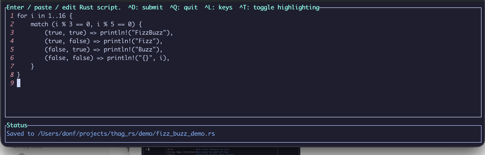
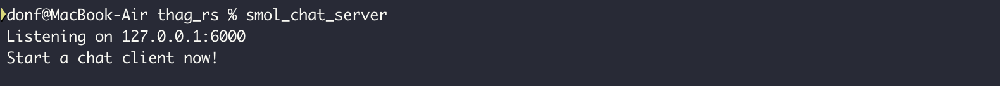
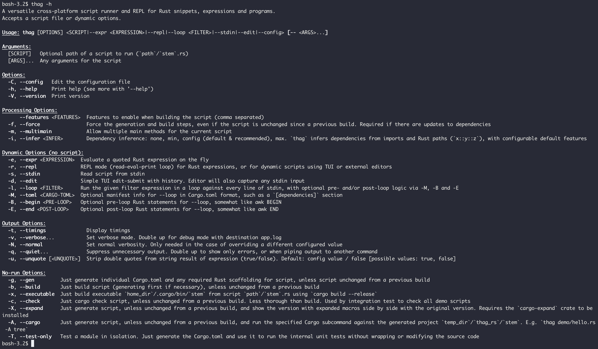

# thag_rs

[](https://crates.io/crates/thag_rs)
[](https://img.shields.io/crates/size/thag_rs)
[](https://github.com/durbanlegend/thag_rs/actions/workflows/ci.yml/badge.svg)

<a href="https://deps.rs/repo/github/durbanlegend/thag_rs"></a>

## Intro

`thag_rs` is a toolkit designed to make your Rust development experience smoother and more rewarding. With the simple `thag` command, you get a script runner, expression evaluator, and REPL all in one place—along with several thoughtful features that address common development pain points.

The core purpose of `thag` is straightforward: eliminate the setup barriers that slow you down when you're trying to test ideas, explore functionality, or debug issues in Rust. It provides the tools you need to quickly experiment without the overhead of creating new projects or writing boilerplate.

One standout feature is dependency inference, which automatically detects and configures the crates your code needs. This means you can often start writing actual code immediately, without manually specifying dependencies. When needed, verbose mode shows you exactly which dependencies were inferred, ready to copy into your scripts for future use.

Since version 0.2, `thag` offers cross-platform profiling capabilities that work consistently across different operating systems—no more platform-specific setup headaches. You can easily:

- Instrument and de-instrument Rust source files automatically with simple #[profiled] function attributes

- Generate execution time and memory usage reports

- Create plain or comparative interactive flamecharts with `inferno`

- Filter profiling output to focus on relevant functions

- Target specific sections of code

Whether you're:

- Prototyping a concept

- Learning how a crate works

- Debugging proc macros

- Running quick calculations

- Profiling code performance

- Converting your scripts into lightning-fast commands

`thag_rs` helps you get answers faster—from simple one-liners to complex multi-file programs.

___

🚀 **The basics:**

- Run Rust code straight from the command line

- Evaluate expressions on the fly

- Interactive REPL mode for rapid prototyping

- Uses AST analysis to understand your code

- Optionally embed custom Cargo manifest settings in "toml block" comments

- Shebang support for true scripting (but you can do better: read on...)

- Loop-filter mode for data processing

🎯 **Smart Features:**

- Toml-free by default: dependency inference from imports and Rust paths (`x::y::z`)

- You're in control: dependency inference (max/min/config/none) and/or toml block

- Beyond shebangs: build instant commands from your snippets and programs

- Execute scripts directly from URLs (GitHub, GitLab, BitBucket, Rust Playground)

- Paste-and-run with built-in TUI editor

- An evolution path for your code from REPL to edit-submit loop to saved scripts

- Edit-submit standard input

- Integrate your favourite editor (VS Code, Helix, Zed, vim, nano etc.)

- Run any Cargo command (clippy, tree, test) against your scripts.
(Yes, you can include unit tests in your scripts)

- View macro expansions side-by-side with your base script.

- Proc macro development support, including proc macro starter kit and an "intercept-and-debug" option to show an expanded view of your proc macro at compile time.

- Automated inclusion of `derive` or other dependency features

- **New in 0.2.0:** `thag` cross-platform profiling library for execution timeline and/or memory usage.
Enable profiling either via `features=profiling` or the `enable_profiling` attribute.
Profiling produces named and timestamped output files.

    There's a tool to instrument functions and methods in a source file with `thag` profiling attributes (`#[profiled]` or (for `fn main`: `#[enable_profiling]`)).

    There's another to select and analyse the desired profiling output and display statistics and regular or differential before/after flamecharts for chosen profiling output files.

    Yet another removes the instrumentation from a source file.

- **New in 0.2.0:** Support for popular terminal themes. `thag` will attempt to choose a theme based on your terminal's background colour.

    Modify the default configuration to specify your preferred themes.

    A new `theme` REPL command displays the current theme:




💡 **Getting Started:**

Jump into `thag`'s collection of 230+ sample scripts in [demo/README.md](https://github.com/durbanlegend/thag_rs/blob/master/demo/README.md) to see what's possible. Suggestions and contributions welcome (under MIT/Apache 2 license) if they fit the goals of the project

## Quick start: ways to run the `thag` command

### * With an expression argument:

```bash
thag --expr '"Hello world!"'                                    # Short form: -e
```


Invoking quiet mode (`--quiet / -q`) suppresses most feedback except for the flowerbox to highlight the output.
Invoking it twice (`-qq` for short) suppresses all non-error feedback including the flowerbox, allowing the
output to be used as a filter.

By default, `thag` and Cargo will feed back to you:

```bash
thag -e ' {
use jiff::{Zoned, Unit};
Zoned::now().round(Unit::Second)?
}'                                                              # Long form: --expr
```


### * With a script:

Here's a sample interactive script for discovering Pythagorean triangles with integer sides:

```bash
thag demo/py_thag.rs
```


```bash
thag demo/iced_tour.rs
```
This will `cargo build` and run the tour of the `iced` cross-platform GUI library. The script is taken from the published examples in the `iced` crate.

#### Using a shebang

To run a script directly from the command line, you can add a shebang of the form `#! /usr/bin/env thag` on line 1. You need to give the script execute permissions in order to run it. E.g. (*nix):

```bash
chmod ug+x demo/fib_basic.rs
demo/fib_basic.rs -- 10
```

This is useful, but a shebang will still mean building the script each time you use it.
Instead, you can simply compile it to a fast Rust command with the --executable (-x) option. See `As an executable` below.

### * As a REPL (Read-Evaluate-Print Loop):

```bash
thag --repl                                                     # Short form: -l
```


The REPL has file-backed searchable history and access to graphical and text-based editors such as VS Code, Zed, Helix, Vim, nano etc. via the VISUAL or EDITOR environment variables, in case its `reedline` editor falls short for a particular task. The key bindings in the latter will depend on your terminal settings and you should probably not expect too much in the way of navigation shortcuts.

### * With standard input:

```bash
echo '(1..=10).product::<u32>()' | thag --stdin                 # Short form: -s
```

Place any arguments for the script after `--` to separate them from `thag` arguments:

```bash
echo 'println!("Hello {}", std::env::args().nth(1).unwrap());' | thag -s -- Ferris
```

This is equivalent to:

```bash
thag -e 'println!("Hello {}", std::env::args().nth(1).unwrap());' -- Ferris
```

### * With the built-in TUI (Terminal User Interface) editor

```bash
thag --edit                                                     # Short form: -d
```



### * With standard input into the TUI editor:

```bash
cat my_file.rs | thag --edit                                    # Short form: -d
```

This allows you to edit or append to the stdin input before submitting it to `thag_rs`. It has file-backed history so you don't lose your edits.

#### Key bindings in the TUI editor
`thag_rs` tries to define all key bindings explicitly. However, the terminal emulator you use is bound to intercept some of these keys, rendering them unavailable to us.
If specific key bindings don't work for you, you may have to adjust your terminal settings. For example:

1. In order for the Option key on Mac to behave correctly in `iterm2`, you may need to choose `iterm2` Settings | Profiles | Keys to specify how to handle the left and right Option keys.
You can choose one of: Normal, Meta or Esc+. The `iterm2` recommended setting of Esc+ is what works in testing.

2. In order for the Shift-Up and Shift-Down key combinations to work on Apple Terminal, you may need to add the following to your Apple Terminal Settings | Profiles | Keyboard settings:
Shift-Up: `\033;[2A` and `Shift-Down`: \033;[2B. Use the Esc key to generate \033. This is not necessary on Iterm2 or WezTerm.

If all else fails, try another terminal emulator.

The TUI editor is also used in the promote-to-TUI (`tui`) and edit history (`history`) functions in the REPL, so the
above also applies there.

Similar considerations apply to the basic REPL mode (--repl / -r). Note that the key bindings there are not identical to the TUI because the basic REPL uses mostly standard `reedline` emacs
key bindings and the TUI uses mostly standard `tui-textarea` key bindings.

### * As a filter on standard input (loop mode):

At a minimum, this loops though `stdin` running the `--loop` expression against every line. The line number and content are made available to the expression as `i` and `line` respectively.

```bash
cat demo/iter.rs | thag --loop 'format!("{i}.\t{line}")' -q    # Short form: -l
```


Note the use of the `--quiet (-q)` option above to suppress messages from Cargo build.

Alternatively:

```bash
thag -l 'format!("{i}.\t{line}")' < demo/hello.rs               # Long form: --loop
```
For a true filter that you can pipe to another process, use `-qq` (or `--quiet --quiet`) to suppress all non-error output.

Loop mode also accepts the following optional arguments supplying surrounding code, along the lines of AWK:

```bash
--cargo (-C)    for specifying dependencies etc. in Cargo.toml format.
--begin (-B)    for specifying any imports, functions/closures, declarations etc. to be run before the loop.
--end   (-E)    for specifying any summary or final logic to run after the loop.
```

Note: In general if you are planning to **pipe Rust output**, it's probably a good idea to use `writeln!(io::stdout())`,
rather than `println!`, since (as at edition 2021) `println!` panics if it encounters an error, and this
includes the broken pipe error from a head command. **This is a Rust issue not a `thag_rs` issue.**
See `https://github.com/BurntSushi/advent-of-code/issues/17`.
For an example of tolerating a broken pipe, see
`demo/thag_from_rust_script.rs`.

### * As an executable:
The --executable (-x) option builds your script in **release mode** and moves it to ~/.cargo/bin/, which is recommended to be in your path.

```bash
thag -x my_script.rs                                            # Long form: --executable
```


You can of course use an OS command to rename the executable if you so desire.


However, it's probably best to rename your source in the first place so you don't lose track of where the command came from if you want to update it.

I **recommend building an executable over using a shebang** because it will be faster on several counts:

- It cuts out the middleman (`thag`)
- You only incur the build overhead once up front
- It will build in release mode, making it much faster to run
- You can use a tool like `llvm-strip` to strip sections from the executable to make it smaller

and more convenient on one count: it dispenses with the need for the `--` argument separator because `thag` is no longer being invoked first, so we don't need to separate two sets of arguments.

Putting it to use:



### * Run `cargo test` in place:
The --test-only (-T) is for scripts (not snippets) with embedded unit tests. (For snippets there's the --cargo (-A) option that accepts cargo subcommands including`test`).
This option leaves the source script untouched but generates a temporary Cargo.toml for it in the usual way and invokes `cargo test` on this to run the internal unit tests.

As usual, `thag` must rely on dependency inference and/or a toml block in the script for the manifest information.
In the following example, `demo/config_with_tests.rs` demonstrates testing a copy of `thag`'s own `config` module with its unit tests embedded and minor adjustments to
import statements and a small toml block for the `thag_rs` crate itself. In this case we pass the absolute path of a file via an environment variable to the unit test that
needs it.

```bash
env TEST_CONFIG_PATH=/absolute/path/to/config.toml thag demo/config_with_tests.rs -Tvf -- --show-output --test-threads=3  # Long form: --test-only
```

### * Command-line options

Hopefully the help screen is self-explanatory:



`thag_rs` uses a **standard `clap` CLI**. You can enter `thag` arguments and options in any order. If your script or dynamic run accepts arguments of its own, they must come after the `thag` arguments and separated from them by a double dash (`--`). In other words, the common convention imposed by `clap`.

## Overview

### Features

_Rust is primarily an expression language.... In contrast, statements serve mostly to contain and explicitly sequence expression evaluation._
_— The Rust Reference_

* Runs serious Rust scripts (not just the "Hello, world!" variety) with no need to create a project.
* Aims to be the most capable and reliable script runner for Rust code.
* A choice of modes:
    * **Expression mode** for small individual expressions on the fly.
    * **REPL mode** offers interactivity, and accepts multi-line expressions since it uses bracket matching to wait for closing braces, brackets, parens and quotes.
    If REPL mode becomes too limiting, you have two alternative ways to promote your expression to a full-fledged script from the REPL editor.
    * **Stdin mode** accepts larger scripts and programs on the fly, as typed, pasted or piped input or as URLs (via `thag_url`).
    * **Edit mode** via a basic TUI (terminal user interface) editor, with optional `thag_url` or other piped input.
    * The classic **script mode** runs an .rs file consisting of a valid Rust snippet or program.


* **Dependency inference** from code, with generation of minimal and maximal toml blocks for pasting into your Rust source script.
* **Any valid Cargo.toml** input may be specified in the toml block, e.g.:
  - Specific features of dependencies for advanced functionality
  - Local path and git dependencies
  - A [profile.dev] with a non-default optimisation level
  - A [[bin]] to rename the executable output.
* You can use a **shebang** to write scripts in Rust, or better yet...
* For **more speed** and a seamless experience you can build your own commands, using the `--executable` (`-x`) option. This will compile a valid script to a release-optimised executable command in the Cargo bin directory `<home>/.cargo/bin`.
* `thag_rs` supports a personal library of code samples for reuse. The downloadable **starter set** in the demo subdirectory contains some 230 demo scripts, including numerous examples from popular crates. It also has many original examples ranging from the trivial to the complex, including many prototypes of concepts used in building the project, such as TUI editing, `syn` AST manipulation, terminal theme detection and colour handling, and CLI and REPL building. There are also demos of compile-time and run-time Rust type detection strategies, informal testing scripts, the script that generates the README for the demos, and a range of fast big-integer factorial and Fibonacci calculation scripts
* Automatic support for **light or dark backgrounds** and a **16- or 256- colour palette** for different message types, according to terminal capability. Alternatively, you can specify your terminal preferences in a `config.toml` file. On Windows prior to the Windows Terminal 1.22 Preview of August 2024, interrogating the terminal is not supported and tends to cause interference, so in the absence of a `config.toml` file, `thag_rs` currently defaults to basic Ansi-16 colours and dark mode support. However, the dark mode colours it uses have been chosen to work well with most light modes.
* In some cases you may be able to develop a module of a project individually by giving it its own main method and embedded Cargo dependencies and running it from `thag_rs`. Failing that, you can always work on a minimally modified copy in another location. This approach allows you to develop and debug a new module without having it break your project. For example the demo versions of colors.rs and stdin.rs were both prototypes that were fully developed as scripts before being merged into the main `thag_rs` project.

### * Getting started:

You have the choice of installing `thag_rs` (recommended), or you may prefer to clone it and compile it yourself and run it via `cargo run`.

* Installing gives you speed out of the box and a simpler command-line interface without invoking Cargo yourself. You have a choice:
```bash
cargo install thag_rs
```
or choose an appropriate installer for your environment from the Github releases page `https://github.com/durbanlegend/thag_rs/releases`, as from `v0.1.1`.

You can also download the starter kit of demo scripts as `demo.zip`
from the same page.

* Cloning gives you immediate access to the demo scripts library and the opportunity to make local changes or a fork.

`thag_rs` uses Cargo, `syn`, `quote` and `cargo_toml` to analyse and wrap well-formed snippets and expressions into working programs. Well-formed input programs are identified by having a valid `fn main` (or more than one - see below) and are passed unchanged to `cargo build`.

`thag_rs` uses `syn` to parse valid code into an abstract syntax tree (AST). Among other benefits this prevents it from being fooled by code embedded in comments or string literals, which is the curse of regular expressions and string parsing. `thag_rs` then uses the `syn` visitor mechanism to traverse the AST to identify dependencies in the code so as to generate a `Cargo.toml`. It filters these to remove duplicates and false positives such as built-in Rust crates, renamed crates and local modules.

Well-formedness is determined by counting occurrences of a `main` function in the AST. The absence of a `fn main` signifies a snippet or expression, whereas more than one `fn main` may be valid but must be actively confirmed as such by the user with the `--multimain (-m)` option.

If your code does not successfully parse into an AST because of a coding error, `thag_rs` will fall back to using source code analysis to prepare your code for the Rust compiler, which can then show you error messages to help you find the issues.

You may provide optional valid (Cargo.toml) metadata in a toml block as described below. `thag_rs` uses `cargo_toml` to parse any metadata into a manifest struct, merges in any dependencies, features or patches inferred from the AST, and then uses `toml` to write out the dedicated Cargo.toml file that Cargo needs to build the script. Finally, in the case of snippets and expressions, it uses `quote` to embed the logic in a well-formed program template and `prettyplease` to format it, and finally invokes Cargo to build it.

All of this happens quite fast: the real bottleneck will be the familiar Cargo build process downloading and compiling your dependencies on the initial build. Cargo build output will be displayed in real time by default so that there are no mystery delays. If you rerun the compiled script it should be almost immediate.

In this way `thag_rs` attempts to handle any valid (or invalid) Rust script, be it a program, snippet or expression. It will try to generate a dedicated Cargo.toml for your script from `use` statements in your code, although for speed and precision I recommend that you embed your own in a toml block:
```/*
[toml]
[dependencies]
...
*/
```
at the start of the script, as you will see done in most of the demos. To help with this, after each successful Cargo lookup `thag_rs `will generate and print a basic toml block with the crate name and version under a `[dependencies]` header, for you to copy and paste into your script if you want to. (As in the second `--expr` example above.) It does not print a combined block, so it's up to you to merge all the dependencies into a single toml block. All dependencies can typically go under the single `[dependencies]` header in the toml block, but thanks to `cargo_toml` there is no specific limit on what valid Cargo code you can place in the toml block.

`thag_rs` aims to be as comprehensive as possible without sacrificing speed and transparency. It uses timestamps to rerun compiled scripts without unnecessary rebuilding, although you can override this behaviour. For example, a precompiled script will calculate the 35,661-digit factorial of 10,000 in under half a second on my M1 MacBook Air.

### Example of using a toml block (`demo/prettyplease.rs`)

    /*[toml]
    [dependencies]
    prettyplease = "0.2.32"
    syn = { version = "2", default-features = false, features = ["full", "parsing"] }
    */

    /// Published example from `prettyplease` Readme.
    //# Purpose: Demo featured crate.
    const INPUT: &str = stringify! {
        use crate::{
              lazy::{Lazy, SyncLazy, SyncOnceCell}, panic,
            sync::{ atomic::{AtomicUsize, Ordering::SeqCst},
                mpsc::channel, Mutex, },
          thread,
        };
        impl<T, U> Into<U> for T where U: From<T> {
            fn into(self) -> U { U::from(self) }
        }
    };

    fn main() {
        let syntax_tree = syn::parse_file(INPUT).unwrap();
        let formatted = prettyplease::unparse(&syntax_tree);
        print!("{}", formatted);
    }

## Installation

### Minimum Supported Rust Version
The minimum supported Rust version (MSRV) for the current version of `thag_rs` is 1.81.0.

### Installation options

#### Cargo install
You can install `thag_rs` using `cargo install`:

```bash
cargo install thag_rs
```
#### Downloading the starter kit (demo directory)
As from `v0.1.1` you can download `demo.zip` from `https://github.com/durbanlegend/thag_rs/releases`.

Note that you can also link to individual demo files via their links in `demo/README.md` and manually download the file from the download icon provided.

As a matter of interest, the `rs_thag` demo file [download_demo_dir.rs](https://github.com/durbanlegend/thag_rs/blob/master/download_demo_dir.rs) can download the whole demo directory from Github.
Click on its link above and from the icons provided by Github you can download it and run it as `thag <dir_path>/download_demo_dir.rs`, or just copy it and paste it into the `thag -d` editor and choose `Ctrl-d` to run it. It should download the entire demo directory from the repo to the directory you choose. Thag pull self up by own sandal straps. Thag eating own dog food! Thag like dog food.

## Usage
Once installed, you can use the `thag` command from the command line. `thag` uses `clap` to process command-line arguments including `--help`.

See the `Quick start` section for a comprehensive introduction. Here are some further examples:

### Evaluating an expression
#### Concise fast factorial calculation

```bash
thag -e '(1..=34).product::<u128>()'
```
This panics beyond 34! due to using Rust primitives, but see `demo/factorial_dashu_product.rs` for arbitrarily big numbers:

#### Shoehorn a script into an expression, just because!
```bash
thag -e "$(cat demo/fizz_buzz_gpt.rs)"
```
The `--expr` flag will not only evaluate an expression, it will also accept a valid Rust program or set of statements.
The different ways `thag` accepts code are as far as possible "orthagonal" to the common way it processes them.

### Running a script in quiet mode but with timings
```bash
thag -tq demo/fizz_buzz_gpt.rs
Completed generation in 0.276s
Completed build in 1.171s
----------------------------------------------------------------------
1
2
Fizz
4
Buzz
Fizz
7
8
Fizz
Buzz
11
Fizz
13
14
FizzBuzz
16
...
89
FizzBuzz
91
92
Fizz
94
Buzz
Fizz
97
98
Fizz
Buzz
----------------------------------------------------------------------
Completed run in 0.558s
thag_rs completed processing script fizz_buzz_gpt.rs in 2.43s
```

### Using the REPL
```bash
thag -r
```
This will start an interactive REPL session where you can enter or paste in a single- or multi-line Rust expression and press Enter to run it. You can also retrieve and optionally edit an expression from history.
Having evaluated the expression you may choose to edit it, and / or the generated Cargo.toml, in your preferred editor (VS Code, Helix, Zed, nano...) and rerun it. The REPL also offers basic housekeeping functions for the temporary files generated, otherwise being in temporary space they will be cleaned up by the operating system in due course.

You can access the last 25 REPL commands or expressions from within the REPL function just by using the up and down arrow keys to navigate history.

#### General notes on REPL
The REPL temporary files are created under the `rs_repl` subdirectory of your temporary directory (e.g. $TMPDIR in *nixes, and referenced as std::env::temp_dir() in Rust). The generated script is called `repl_script.rs`.

The REPL feature is not suited to scripts of over about 1K characters, due to the limitations of the underlying line editor. If you're in REPL mode and it starts cramping your style, you can clear the REPL command line with `Ctrl-u` and promote the current expression to a full-blown script using either the built-in TUI editor with history support, or the editor of your choice without history support. Both of these options mean that your Rust script no longer has to be a smallish single expression, and both allow you to save your script to a .rs file or your choice and run it from the command line after you exit the REPL session.

1. _The TUI editor._ The `tui` REPL command will open your current REPL expression in the built-in TUI editor. When you've finished editing, you can run it with `Ctrl-d` and/or save it to a .rs file of your choice. The `tui` command will also place the expression in the TUI editor's history, which by the way is kept separate from the REPL's history because it is not subject to the same limitations. `Ctrl-d` will autosave your changes so that you can keep repeating the cycle of `tui` and `Ctrl-d` until you're satisfied with the outcome. The TUI editor is pretty basic but has the advantage of file-backed history support so you can come back to your code later.

2. _Your preferred editor._ You can enter the `edit` command on the REPL command line to edit your script in your preferred editor as configured via the $VISUAL or $EDITOR environment variables, and save it from there. Get back to the REPL session by closing the edit session or tabbing back in the operating system, and run the updated code with the REPL's `run` command. Alternatively you can save the source to a .rs file. As with `tui` and `Ctrl-d`, you can keep repeating the cycle of `edit` and `run` until you're satisfied. However, since the `edit` command has no history support, the only way to see it or preserve the final code in history is to switch to the `tui` command once you've finished, which will add it to the TUI history.

## Usage notes

### Testing changes to dependencies

As mentioned earlier, ``thag_rs`` uses timestamps to rerun compiled scripts without unnecessary rebuilding. You can override this behaviour with the `--force (-f)` option.

This is important to note if you are using the script to test changes to a dependency specified in the toml block, typically as a path dependency but possibly a git or even a version dependency.

When using a git dependency that resides on GitHub, you may need to specify the `rev` parameter to pick up the latest version. This is a feature of GitHub, not of `thag_rs`.

If you make changes to the dependency but not to the script, you need to specify -f to rebuild the script so that it will pick up the changed dependency.

### Other dependency tips

Missing toml entries are not pulled in for crates that are only referenced by qualified paths instead of being imported with `use`. In this case you need to add either a toml block entry or at least one "redundant" `use <crate>...;` statement for the crate.

If you want to ensure that a dependency in a TOML block is up to date, you can get the latest version in copyable format by issuing `cargo search <crate> [--limit 1]` from the command line. Alternatively, comment it out temporarily with a hash (`#`) and let `thag -c` do the search for you.

## Platform Support
This crate is designed to be cross-platform and supports MacOS, Linux and Windows.

### Currently tested on:
* MacOS (M1) Sonoma and Sequoia
* Linux: Zorin and (WSL2) Ubuntu
* Windows 11:
  - PowerShell 5 and 7
  - CMD
  - Windows Console
  - Windows Terminal up to 1.22 Preview with OSC query support.
  - WSL2
* GitHub Actions test each commit and PR on `ubuntu-latest`, `macos-latest` and `windows-latest`.

### Using `thag_rs` as a library

If you choose to use `thag-rs` functionality in your code, you can significantly reduce its footprint
by choosing only the features you need

#### Feature dependency tree:

```
default
└── full
    ├── repl
    │   └── tui
    │       ├── build
    │       │   ├── ast
    │       │   │   ├── core  ★                # Fundamental feature set
    │       │   │   │   ├── error_handling     # Error types and handling
    │       │   │   │   ├── log_impl           # Basic logging infrastructure
    │       │   │   │   │   └── (simplelog | env_logger)
    │       │   │   │   └── styling            # Basic terminal styling
    │       │   │   ├── quote
    │       │   │   └── syn
    │       │   ├── config
    │       │   │   ├── core  ★ (shared)       # Core features required here too
    │       │   │   ├── mockall
    │       │   │   ├── serde_with
    │       │   │   └── toml/toml_edit
    │       │   └── crossterm                  # Terminal control
    │       │
    │       ├── ratatui                        # TUI framework
    │       ├── tui-textarea                   # Text editing widget
    │       ├── crokey                         # Keyboard handling
    │       ├── serde_json                     # JSON support
    │       └── scopeguard                     # Resource cleanup (shared with color_detect)
    │
    └── color_detect     # Optional terminal detection, only included in full
        ├── crossterm    # (shared with build)
        ├── scopeguard   # (shared with tui)
        ├── supports-color
        └── termbg
Core Feature Set (★):
- Basic logging and error handling
- Essential macros: cprtln, debug_log, lazy_static_var, vlog, regex
- Styling system and macros: cvprtln, style_for_level
- Profiling instrumentation macros: profile
- Fundamental types and traits
Optional features:
- profiling     # Enables profiling output (instrumentation always available in core)
- debug-logs
- nightly
- format_snippet
Common Usage Patterns:
1. Just core functionality:
   features = ["core", "simplelog"]
2. Core with profiling enabled:
   features = ["core", "simplelog", "profiling"]
3. Core with color detection:
   features = ["core", "color_detect", "simplelog"]
4. Full functionality with profiling:
   features = ["full", "simplelog", "profiling"]
Optional features can be added at any level:
- debug-logs
- nightly
- format_snippet
- profiling
Note: When using without default features, must specify a logging implementation:
cargo add thag_rs --no-default-features --features="repl,simplelog"
or
cargo add thag_rs --no-default-features --features="repl,env_logger"
```

## Why "thag"?

After the late Thag Simmons. A stone-age power tool for the grug brained developer to beat Rust code into submission. Why type long name when short sharp name do trick?

## Related projects

(Hat-tip to the author of `rust-script`)

* `cargo-script` - The Rust RFC Book `https://rust-lang.github.io/rfcs/3424-cargo-script.html`
* `evcxr` - Perhaps the most well-known Rust REPL.
* `cargo-script` - (Unrelated to the Rust RFC one). Rust script runner (unmaintained project).
* `rust-script` - maintained fork of the preceding cargo-script.
* `cargo-eval` - maintained fork of the preceding cargo-script.
* `cargo-play` - local Rust playground.
* `irust` - limited Rust REPL.
* `runner` - experimental tool for running Rust snippets without Cargo, exploring dynamic vs static linking for speed. I have an extensively modified fork of this crate on GitHub, but I highly recommend using the current `thag_rs` crate rather than that fork.
* `cargo-script-mvs` - RFC demo.

There is more discussion of prior art at the Rust RFC link.

## License

SPDX-License-Identifier: Apache-2.0 OR MIT

Licensed under either of

    Apache License, Version 2.0 (LICENSE-APACHE or http://www.apache.org/licenses/LICENSE-2.0)

or

    MIT license (LICENSE-MIT or http://opensource.org/licenses/MIT)

as you prefer.

## Contributing

Contributions will be considered if they fit the goals of the project.

Unless you explicitly state otherwise, any contribution intentionally submitted for inclusion in the work by you will be dual-licensed as above, without any further terms or conditions.
