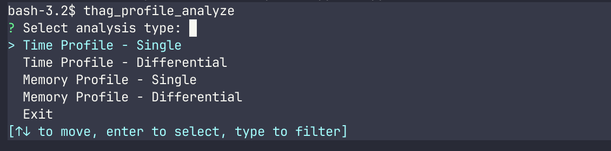
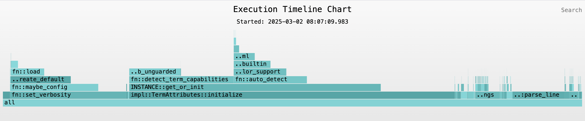

# User Guide to Application Profiling with `thag_profiler`

## Introduction

Profiling is key to optimizing your Rust applications, but it tends to be time-consuming (no pun intended).
`thag_profiler` aims to provide quick, straightforward and consistent basic run-time and memoryprofiling for your Rust project or script across all platforms.

`thag` profiling is intrusive, meaning that you need to instrument your code at least temporarily for profiling.
`thag` provides an automated instrumentation tool to do the instrumentation. This is designed to be "lossless", preserving the original code intact with its comments
and formatting, and adding necessary instrumentation in the form of simple #[profiled] function attributes (and #[enable_profiling] in the case of `fn main`) using the `rust-analyzer` syntax tree library `ra_ap_syntax`.
A second tool is provided to remove the instrumentation.

You can instrument and profile any module or modules of a project, or a user script provided that the script has a `main` function (i.e. not a snippet).

The run-time overhead of instrumentation is zero if the `profiling` feature is disabled, as compilation will leave the instrumented functions untouched.
If the `profiling` feature is enabled, a sync or async wrapper is transparently added around the function as appropriate, to instantiate a `Profile` object to
profile the execution time and-or memory usage. Profiling overhead is excluded from the reported execution time.

`thag_profiler` will work with async as well as non-async code. It uses Rust's `backtrace` crate to populate the call stack for each Profile instance,
stripping out any non-profiled functions including scaffolding for asynccrates such as `tokio`.

This guide explains how to use `thag_profiler`, alone or in conjunction with `thag_rs` to identify performance bottlenecks, analyze memory usage, and optimize your code.

## Quick-start guide

# Installing the Profiling Tools

Thag includes several profiling tools that can be installed separately:

```bash
# Install the instrumentation tool
cargo install thag_rs --no-default-features --features=profile_instrument --bin thag_profile_instrument --force

# Install the removal tool
cargo install thag_rs --no-default-features --features=profile_instrument --bin thag_profile_remove --force

# Install the analysis tool
cargo install thag_rs --no-default-features --features=profile_analyze --bin thag_profile_analyze --force
```

1. Instrumenting your script or module:

    ```bash
    thag_profile_instrument 2021 < demo/factorial_ibig_product.rs > demo/factorial_ibig_product_profile.rs
    ```

    Note that `thag_profile_instrument` requires the Rust edition of your project or script for the benefit of the `ra_ap_syntax` crate.

    Comparing before and after with `vimdiff`:

    ```
    vimdiff demo/factorial_ibig_product.rs demo/factorial_ibig_product_profile.rs
    ```

    

    If you're profiling a project source file, at this point you'd want to replace the uninstrumented code with the instrumented version.

2. Profiling your code:

      ```bash
      thag demo/factorial_ibig_product_profile.rs
      ```

    Comparing before and after with `vimdiff`:

    ```
    vimdiff demo/factorial_ibig_product_profile.rs demo/factorial_ibig_product_profile_profile.rs
    ```

    

## Enabling Profiling

There are two ways to enable profiling in `thag_rs`:

1. Via an `#[enable_profiling]` attribute on the main function.

    ```rust
    #[enable_profiling]
    fn main() {
        // Your code here
    }
    ```


    You can specify the profiling type when enabling profiling:

    ```rust
    #[enable_profiling(profile_type = "<type>")]
    ```

    Enables profiling globally for the entire application. Valid values for `<type>` are "time", "memory", or "both". The default is "both".

2. Via a `profiling` Cargo feature flag in your project's `Cargo.toml` file or your script's toml block- Use this for occasional profiling during development:

  ```rust
  /*[toml]
  ...
  [features]
  profiling = []
  ...
  */
  ```

  ```bash
  cargo run --features profiling -- your_script.rs
  ```

## Profiling Types

thag_rs supports two types of profiling, separately or combined:

- Time Profiling: Measures wall-clock execution time of functions
- Memory Profiling: Tracks memory allocation and usage
- Both: Combines time and memory profiling

You can also specify the profiling type programmatically:

```rust
// In your code
profiling::enable_profiling(true, ProfileType::Both)?;
```

## Instrumenting Your Code

### Automatic Instrumentation

For easier profiling, `thag_rs` provides tools to automatically instrument your code. See the Quick-start guide for installation instructions.

#### Using the profile_instrument tool

For existing source files, you can use the profile_instrument tool to automatically add profiling attributes:

```bash
thag_profile_instrument <edition_yyyy> < path/to/your/source.rs > path/to/destination.rs
```

This will add `#[profiled]` attributes to functions and methods (excluding tests, TODO investigate), and `#[enable_profiling]` to main() if present.
You can of course

#### Removing Instrumentation

When you're done profiling, you can remove the instrumentation:

```bash
thag_profile_remove <edition_yyyy> < path/to/your/source.rs > path/to/destination.rs
```


### Manual Instrumentation

#### Using the `#[profiled]` attribute

You can add the `#[profiled]` attribute to any function to profile it with a meaningful function or method name:
For regular functions this will profile the function as `fn::<function_name>`.
For methods, this will profile the method as `method::<method_name>`. See below for how to add the name of the
implementation type or trait.

```rust
use thag_proc_macros::profiled;

#[profiled]
fn expensive_calculation() -> u64 {
    // Your code here
}

// Also works with async functions!
#[profiled]
async fn fetch_data() -> Result<String, Error> {
    // Async operations
}
```

The `#[profiled]` attribute supports several options:

1. `imp` option (because "impl" is a reserved keyword):

```rust
#[profile(imp = "<type>")]
```
For method annotation, prefixes the method name with the name of the implemented type.
E.g. for a struct named `MyStruct`, the method `my_method` would be annotated as:

```rust
#[profile(imp = "MyStruct")]
fn my_method(&self) { /* ... */ }
```

2. `trait_name` option:

```rust
#[profile(trait_name = "<type>")]
```

For method annotation, prefixes the method name with the name of the implemented trait.
E.g. If implementing a trait named `MyTrait`, the method `my_method` could be annotated as:

```rust
#[profile(trait_name = "MyTrait")]
fn my_method(&self) { /* ... */ }
```

This is an alternative to the imp option above.

3. `profile_type` option:

```rust
#[profile(profile_type = "<type>")]
```
Specifies the type of profiling to be performed. Valid values are "global", "time", "memory", or "both". "global" specifies to use the same value as specified or defaulted in the `#[enable_profiling]` attribute.

For fine-grained control, you can manually profile specific functions or code sections:

```rust
fn my_function() {
    // Profile the whole function
    profile_fn!("my_function");

    // Do some work...

    // Profile a specific section. Initializes a new Profile instance and returns a reference to it.
    // You may optionally end the profile section manually as shown below, or it will automatically
    // end at the end of the current scope (block or function).
    let profile_section = profile_section!("expensive_operation");
    for i in 0..1000 {
        // Expensive operation here
    }
    // End the profile section. Cause the Profile to be dropped, writing out the profile data in the `drop` function.
    profile_section.end();

    // Profile memory usage specifically TODO return a reference so we can manually end it.
    profile_memory!("allocate_large_buffer");
    let buffer = vec![0; 1_000_000];

    // Profile both time and memory
    profile_both!("complex_operation");
    // Operation that's both CPU and memory intensive
}
```

## Conditional Profiling with cfg attributes

### Using a Custom Feature Flag

You can make profiling conditional on a custom feature flag:

```rust
// Only apply profiling when the "profile" feature is enabled
#[cfg_attr(feature = "profile", profile)]
fn expensive_calculation() -> u64 {
    // Your code here
}
```

### Using debug_assertions

To profile only in debug builds (not release):

```rust
// Only apply profiling in debug builds
#[cfg_attr(debug_assertions, profile)]
fn expensive_calculation() -> u64 {
    // Your code here
}
```

### Combining with Profile Options

You can still use profiling options with conditional compilation:

```rust
// Apply profiling conditionally with custom options
#[cfg_attr(feature = "profile", profile(imp = "MyStruct"))]
fn my_method(&self) {
    // Method implementation
}
```

### Multi-condition Example

You can combine multiple conditions:

```rust
// Apply profiling only in debug builds with profiling feature enabled
#[cfg_attr(all(debug_assertions, feature = "profile"), profile)]
fn complex_operation() {
    // Complex operation code
}
```

### Applying to Trait Implementations

Conditional profiling works well with trait implementations too:

```rust
impl SomeTrait for MyStruct {
    #[cfg_attr(feature = "profile", profile(trait_name = "SomeTrait"))]
    fn trait_method(&self) {
        // Method implementation
    }
}
```

## Section profiling: TODO editing
### Usage Examples

Here are some usage examples to document in your code:

#### Basic Usage

```rust
fn my_function() {
    // Regular code here

    // Start a profiled section
    let section = profile_section!("expensive part");

    // Code that will be profiled
    expensive_operation();

    // End the profiled section
    section.end();

    // More code that won't be profiled
    cleanup();
}
```

### With Active Checking

```rust
fn process_data(data: &[u32]) {
    let section = profile_section!("data processing");

    // Optional: You can check if profiling is active
    if section.is_active() {
        println!("Profiling is enabled for this section");
    }

    // Process the data
    for item in data {
        process_item(item);
    }

    // End the profiling
    section.end();
}
```

#### With Conditional Logic

```rust
fn process_data(data: &[u32]) {
    let section = profile_section!("data processing");

    if data.is_empty() {
        // End early if there's no data
        section.end();
        return;
    }

    // Process the data
    for item in data {
        process_item(item);
    }

    // End the profiling
    section.end();
}
```

#### Error Handling Example

```rust
fn fallible_operation() -> Result<(), Error> {
    let section = profile_section!("fallible op");

    // Try the operation
    let result = match do_something_risky() {
        Ok(value) => value,
        Err(e) => {
            // End profiling before returning the error
            section.end();
            return Err(e);
        }
    };

    // Continue with more operations
    do_more_stuff(result)?;

    // End profiling before returning success
    section.end();
    Ok(())
}
```

### Implementation Notes

1. This approach doesn't interfere with the code being profiled - it simply measures the time between creation and ending.

2. The `end()` method consumes `self`, ensuring that a profile section can only be ended once.

3. You don't need to add anything to your `Drop` implementation for `Profile` - it will work as is.

4. If you want to add more functionality, like pausing/resuming profiling, you can add more methods to `ProfileSection`.


## Analyzing Profile Results

### Profile Output

Profiling generates folded stack files with timestamps in your current directory:

- {executable_name}-{timestamp}.folded - For time profiling
- {executable_name}-{timestamp}-memory.folded - For memory profiling

### Using the Profiling Analyzer

thag_rs includes a powerful analysis tool:

```bash
cargo run --bin profile_analyze -- [options]
```



### Profile Analysis Tool Menus

#### Main Menu

The main menu provides the following options:

- **Time Profile - Single**: Analyze a single time profile file
- **Time Profile - Differential**: Compare two time profile files
- **Memory Profile - Single**: Analyze a single memory profile file
- **Memory Profile - Differential**: Compare two memory profile files
- **Exit**: Exit the analysis tool

#### File Selection Menu

After selecting an analysis type, you'll see a list of available profile files grouped by executable name:

```
Available profile files:
1. tui_ta_editor_profile (2 files)
   1.1: tui_ta_editor_profile-20250228-090304.folded
   1.2: tui_ta_editor_profile-20250228-090125.folded
2. `thag` (4 files)
   ...
```

Options:
- **Filter/modify selection**: Apply a filter to narrow down the list of files
- **[numbered options]**: Select a specific group of profile files

#### Time Profile - Single Menu

After selecting a specific profile file, you'll see these options:

- **Show Flamechart**: Generate and display an interactive flamechart visualization
- **Filter Functions (Recursive or Exact Match)**: Apply filters to focus on specific functions
- **Show Statistics**: Display statistical summary of profiling data
- **Back to Profile Selection**: Return to the file selection menu

#### Time Profile - Differential Menu

After selecting two profile files to compare, you'll see:

- **Show Differential Flamechart**: Generate a comparative flamechart highlighting differences
- **Show Statistics Comparison**: Compare statistical data between the two profiles
- **Back to Profile Selection**: Return to the file selection menu

#### Memory Profile - Single Menu

Similar to the Time Profile menu, but focused on memory allocation data:

- **Show Memory Flamechart**: Generate a flamechart showing memory usage patterns
- **Show Memory Statistics**: Display summary statistics of memory allocations
- **Back to Profile Selection**: Return to the file selection menu

#### Memory Profile - Differential Menu

Compares memory usage between two profile runs:

- **Show Differential Memory Flamechart**: Visual comparison of memory usage
- **Show Memory Statistics Comparison**: Compare allocation statistics
- **Back to Profile Selection**: Return to the file selection menu

### Interpreting Results

The analyzer produces:

1. Statistical Summary: Shows function calls, total time, average time
2. Interactive Flamechart: Visual representation of performance data

#### Flamecharts

Flamecharts provide an intuitive visualization of your profiling data.
The wider a function appears, the more time it takes relative to the total execution.
Flamecharts are interactive SVGs that allow you to zoom in on specific functions,
hover over functions to see detailed information, search for specific functions,
and compare before/after optimizations. See the sample image below or click [here](assets/flamechart_time_20250302-080709.svg) to interact with it.

You may be more familiar with flamegraphs than flamecharts. Flamecharts are distinguished by laying out data on the horizontal axis chronologically instead of alphabetically.
Thag profiling uses flamecharts to reflect the sequence of events, in particular for the execution timeline. For memory profiling the sequence will be the sequence of `drop` events,
since this is the point at which `thag` profiling records the allocation and deallocation.

`thag` uses the `inferno` crate to generate flamecharts. For the execution timeline, the analysis tool allows you to choose the `inferno` color scheme to use. For the memory flamechart,
it uses `inferno`'s memory-optimized color scheme.



[Try it!](assets/flamechart_time_20250302-080709.svg)

As the above link demonstrates, interactive features of the SVG flamecharts include:

- **Zoom**: Click on a function to zoom in
- **Details**: Hover over a function to see detailed information
- **Search**: Search for specific functions
- **Differential view**: Compare before/after optimizations

## Profiling Best Practices

1. **Profile representative workloads**: Make sure your test cases represent real-world usage.
2. **Focus on hot paths**: Look for the widest blocks in your flamechart - these are your performance bottlenecks.
3. **Compare before/after**: Always compare profiles before and after optimization to ensure you've made an improvement.
4. **Watch for memory bloat**: Use memory profiling to identify excessive allocations.
5. **Verify changes**: Before running or committing source code changes made by the automated tools, be sure to verify the changes with a diff tool.
6. **Use serial testing**: When writing tests that use profiled functions, use the serial_test crate:

```rust
use serial_test::serial;

#[test]
#[serial]
fn test_profiled_function() {
    // Tests using profiled functions
}
```

This is important because `thag_rs` profiling maintains global state that isn't thread-safe.

## Advanced Features

### Profiling Async Code

The `#[profiled]` attribute works seamlessly with async functions:

```rust
#[profiled]
async fn process_data() -> Result<Data, Error> {
    // Async operations
}
```

The profiler will correctly track time spent in the future, including time between .await points.

### Ending Profile Sections Early

Sometimes you may want to end profiling before a section's scope ends:

```rust
fn complex_operation() {
    profile_section!("initialization");
    // Initialization code...

    if skip_rest {
        end_profile_section("initialization"); // End early
    }

    // More code...
}
```

### Custom Profile Names

You can provide custom names for profiled methods:

```rust
impl MyStruct {
    #[profiled]
    fn process(&self) {
        // This will be profiled as "fn::process"
    }

    // With custom name
    fn calculate(&self) {
        profile_method!("MyStruct::custom_calculate");
        // This will be profiled as "MyStruct::custom_calculate"
    }
}
```

## Troubleshooting

### Common Issues

1. **Missing profile output**: Ensure profiling is enabled and you have write permissions in the current directory.
2. **Test failures**: Profiled tests, as well as tests that call profiled functions, must use the #[serial] attribute from the serial_test crate to prevent concurrent access to profiling data.
3. **Overhead**: Profiling, and in particular memory profiling, adds some overhead. For extremely performance-sensitive code, be aware that the measurements include this overhead.
Instrumented code should not add a great deal of overhead when profiling is not enabled, but for time_sensitive code you may wish to remove instrumentation. The `thag_profile_remove` tool
is effective for this.
4. **Inappropriate redirection**: Do not redirect the output of either the `thag_profile_instrument` tool or the `thag_profile_remove` tool back to the input file. Redirect it to a different file and compare the two before
overwriting the original file with the modified version.

### Inspecting Profile Files

The folded stack files are human-readable. You can inspect them directly:

```bash
head your-executable-timestamp.folded
```

## Conclusion

`thag_rs` profiling aims to provide a simple but effective cross-platform solution for understanding and optimizing your Rust code
by combining easy instrumentation, detailed analysis, and interactive visualizations to help make your code faster and more efficient.

You can get started quickly by running `thag`'s `profile_instrument` tool to auto-instrument one or more source files of interest with #[profiled]
attributes, and (in the case of `fn main`), `#[enable_profiling]` attributes. Then run your code as normal with the `#[enable_profiling]` attribute,
or if running a script from `thag` you can use `features=profiling`, and on termination run the `profile_analyze` tool to select and analyze the profile data in the current directory.
