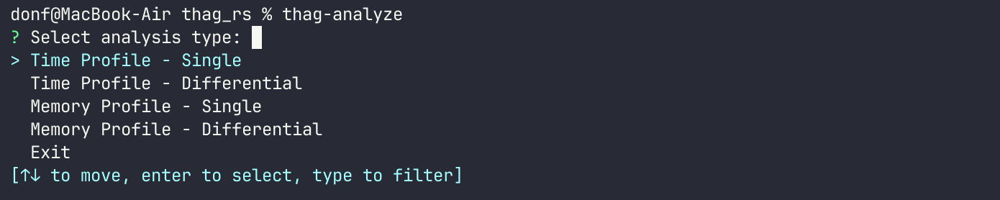
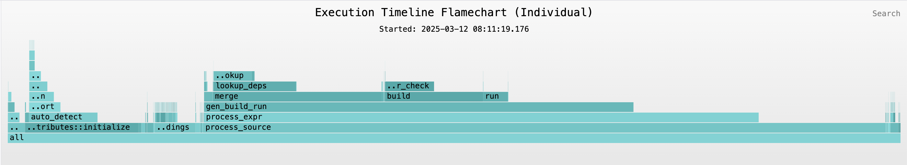

# thag_profiler

A straightforward, lightweight profiling library for Rust applications that provides time profiling with minimal overhead, and memory profiling with
more substantial runtime overhead.

## Features

- **Zero-cost abstraction**: No runtime overhead when profiling is disabled

- **Time and memory profiling**: Track execution time or memory usage, or both.

    **Notes:**

    Memory profiling (the optional `full_profiling` feature) uses the `re_memory` crate's global allocator.

    1. This is incompatible with specifying your own global allocator.

    2. It is also incompatible with std::thread_local storage (TLS) in your code or its dependencies. You will get an error: "fatal runtime error: the global allocator may not use TLS with destructors".

        For instance this is a known issue with `async_std`, but not with its official replacement `smol`, nor with `tokio`.

- **Function and section profiling**: Profile entire functions or specific code sections, down to single instructions.

- **Async support**: Seamlessly works with async code.

- **Automatic instrumentation**: Tools to quickly add and remove profiling annotations without losing comments or formatting (but verify!).

- **Interactive flamegraphs and flamecharts**: Visualize performance bottlenecks, do before-and-after comparisons.

- **Cross-platform**: Works on all platforms supported by Rust.

## Installation

Add `thag_profiler` to your `Cargo.toml`:

```toml
[dependencies]
# For instrumentation only (default)
thag_profiler = "0.1.0"

# For time profiling only
thag_profiler = { version = "0.1.0", features = ["time_profiling"] }

# OR for comprehensive profiling (time + memory)
thag_profiler = { version = "0.1.0", features = ["full_profiling"] }
```

Install the profiling tools:

```bash
# Install all tools
cargo install thag_profiler --no-default-features --features=tools

# Or install individual tools
cargo install thag_profiler --no-default-features --features=instrument-tool --bin thag-instrument
cargo install thag_profiler --no-default-features --features=instrument-tool --bin thag-remove
cargo install thag_profiler --no-default-features --features=analyze-tool --bin thag-analyze
```

## Quick Start

### 1. Instrument Your Code

#### a. Automatically instrument your code for profiling:

Replace `2021` with your project's Rust edition:

```bash
thag-instrument 2021 < path/to/your/file.rs > path/to/your/instrumented_file.rs
```

* Ensure your original source is backed up before instrumenting.

* Replace `2021` with your project's Rust edition.

* Do not redirect the output to your source file! Trust Thag!

* Compare generated code with original to ensure correctness before overwriting
any original code with instrumented code.

Repeat for all modules you want to profile.

####     ... AND / OR ...

#### b. Manually add profiling annotations:

```rust
use thag_profiler::{profiled, profile};

// Instrument a function
#[profiled]
fn expensive_calculation() -> u64 {
    // Function code...
    42
}

// Profile a specific section
fn complex_operation() {
    // Some code...

    let section = profile!("expensive_part");
    // Code to profile
    expensive_operation();
    section.end();

    // More code...
}
```

### 2. Enable Profiling in Your Build

#### Manifest info

##### In Scripts run with the `thag` script runner

When using `thag_profiler` in scripts, you have two options:

**1. Enable via command line** (recommended):

  ```bash
  cargo run bank/mem_prof.rs --features=my_profiling
  ```

  With this script configuration:

  ```toml
  /*[toml]
  [dependencies]
  thag_profiler = { version = "0.1" }

  [features]
  # For time profiling only
  my_profiling = ["thag_profiler/time_profiling"]

  # OR for comprehensive profiling (time + memory)
  my_profiling = ["thag_profiler/full_profiling"]
  ```

**OR**

**2. Enable directly in the dependency**:

```rust
/*[toml]
[dependencies]
thag_profiler = { version = "0.1", features = ["time_profiling"] }
*/
```

##### In Regular Cargo Projects

In standard Cargo projects, the same options apply, only directly in Cargo.toml:

**1. Use feature propagation**:
   ```toml
   [dependencies]
   thag_profiler = { version = "0.1" }

   [features]
   my_profiling = ["thag_profiler/time_profiling"]
   ```

   Then run with:
   ```bash
   cargo run --features my_profiling
   ```

**OR**

**2. Enable directly in the dependency**:
   ```toml
   [dependencies]
   thag_profiler = { version = "0.1", features = ["full_profiling"] }
   ```

#### In code

**EITHER**

**1. With an attribute (recommended)**

Enable profiling by adding the #[enable_profiling] attribute to your `main` function.

The `main` function will be taken to be the root of the profiling callstack.

```rust
use thag_profiler::profiled;

#[enable_profiling]
fn main() {
    // Your program...
}
```

**OR**


**2. Programmatically**

This is is more flexible as it allows you to enable or disable profiling at runtime according to
command-line input, environment variables etc. You can also use it to restrict fully-instrumented
code to only basic time profiling.

```rust
use thag_profiler::{profiling::enable_profiling, ProfileType};

fn main() {
    // Enable both time and memory profiling
    enable_profiling(true, ProfileType::Both).expect("Failed to enable profiling");

    // Your program...
}
```

### 3. Run Your Application

### 4. Analyze Results

After running your application with profiling enabled, folded stack files will be generated in the current working directory.
Use the included analysis tool to visualize the results:

```bash
thag-analyze
```

This will open an interactive menu to explore your profiling data.

## Detailed Usage

### Function Profiling with `#[profiled]`

Add the `#[profiled]` attribute to any function you want to profile:

```rust
use thag_profiler::profiled;

// Regular function
#[profiled]
fn expensive_calculation() -> u64 {
    // Function code...
}

// Works with async functions too
#[profiled]
async fn fetch_data() -> Result<String, Error> {
    // Async operations...
}

// Methods in implementations
impl MyStruct {
    #[profiled]
    fn process(&self, data: &[u8]) {
        // Method code...
    }
}
```

#### Attribute Options

The `#[profiled]` attribute supports a profile_type option:

```rust
// Override the profile type for a specific function (time, memory, or both)
#[profiled(profile_type = "both")]
fn allocating_function() { /* ... */ }
```

#### Order of attributes

If both `#[enable_profiling]` and `#[profiled]` attributes are used, they should be specified in that order.

```rust
#[enable_profiling]
#[profiled]
fn main() { /* ... */ }
```

If used to decorate a main function that has the attribute `#[tokio::main]`, they should come before `#[tokio::main]`.

```rust
#[enable_profiling]
#[profiled]
#[tokio::main]
async fn main() { /* ... */ }
```

### Controlling Profiling at Runtime

You can programmatically control profiling:

```rust
use thag_profiler::{disable_profiling, enable_profiling, ProfileType};

fn main() {
    // Enable profiling programmatically
    enable_profiling(true, Some(ProfileType::Time));

    // Run code with profiling...

    // Disable profiling for a section
    disable_profiling();
    run_unprofiled_section();

    // Re-enable for another section (profile type according to feature "full_profiling" or "time_profiling"))
    enable_profiling(true, None);
    run_profiled_section();
}
```

### Code Section Profiling with `profile!`

Use the `profile!` macro to profile specific sections of code:

```rust
use thag_profiler::profile;

fn complex_function() {
    // Basic usage
    let section = profile!("initialization");
    initialize_things();
    section.end();

    // Profile a method
    let section = profile!(method);
    self.do_something();
    section.end();

    // Profile memory usage
    let section = profile!("allocation", memory);
    let data = vec![0; 1_000_000];
    section.end();

    // Profile async code
    let section = profile!("async_operation", async);
    async_operation().await;
    section.end();

    // Combined options
    let section = profile!(method, both, async);
    self.complex_async_operation().await;
    section.end();
}
```

### Nesting Profiles

Profiles can be nested to track hierarchical operations:

```rust
use thag_profiler::profile;

fn complex_operation() {
    let meal_section = profile!("3_course_meal");

    let starter_section = profile!("starter");
    // Starter course code...
    starter_section.end();

    let mains_section = profile!("main_course");
    // Main course code...
    mains_section.end();

    let dessert_section = profile!("dessert");
    // Dessert course code...
    dessert_section.end();  // Optional if about to go out of scope anyway

    meal_section.end();  // Optional if about to go out of scope anywa
}
```

### Conditional Profiling

You can conditionally enable profiling based on build configuration:

**1. Attribute macro example**

```rust
// Only apply profiling when a feature is enabled
#[cfg_attr(feature = "my_profile_feature", profiled)]
fn expensive_calculation() { /* ... */ }

// Only profile in debug builds
#[cfg_attr(debug_assertions, profiled)]
fn complex_operation() { /* ... */ }
```


**2. Declarative macro example**

```rust
fn process_data(data: &[u8]) {
    // Only include profiling in debug builds
    #[cfg(debug_assertions)]
    let process_section = profile!("process_data");

    // Your code here...

    #[cfg(debug_assertions)]
    process_section.end();

    ...
}
```

### Memory Profiling Details

When using memory profiling (with the `full_profiling` feature), you can choose
to do very limited and specific profiling:

```rust
#[cfg(feature = "full_profiling")]
use thag_profiler::{Profile, ProfileType};

fn memory_intensive_operation() {
    #[cfg(feature = "full_profiling")]
    let _p = Profile::new("memory_operation", ProfileType::Memory);

    // This will track memory allocations and deallocations
    let large_vec = vec![0; 1_000_000];

    // Process the vector...

    // Memory will be reported when _p goes out of scope
}
```

## How It Works

### Time Profiling

Time profiling measures the wall-clock time between profile creation and destruction. It has minimal overhead and is suitable for most performance investigations.

### Memory Profiling

Disclaimer: `thag_profiler` memory profiling aims to provide a practical and convenient solution to memory profiling that is compatible with async operation.

Memory profiling (available with the `full_profiling` feature) tracks heap allocations during the profiled section. It uses the `re_memory` crate, which
works by installing a global memory allocator that uses sampling to track allocation events with their call stacks. When a `thag_profiler` `Profile` is dropped,
as its final act it retrieves the tracking data from the `re_memory` allocator, finds the matching call stack and reports the associated usage estimate based on
the sampled data.

The memory allocation estimates in `thag_profiler` are thus a best estimate based on sampled data. They are intended to provide a rough first-order estimate of memory
usage and identify hotspots. They can't cater for secondary effects such as multiple instances of the same function or code section running in parallel, so read
the stats, flamegraphs and flamecharts with that caveat. They should certainly not be relied upon for precise measurements.

I've tried various options and this is the best I've found so far. If you have any suggestions or improvements, please feel free to open an issue. If you prefer
to use a different analysis tool like `valgrind` or `heaptrack`, you can disable `thag_profiler` memory profiling by removing the `full_profiling` feature or
downgrading to the `time_profiling` feature.

**Note:** Memory profiling is about memory analysis, not about speed. `thag_profiler` memory profiling has distinctly higher overhead than time profiling and will
noticeably affect performance.
It's recommended to use it selectively for occasional health checks and targeted investigations in development rather than leave it enabled indefinitely.

### Profile Output

Profiles generate "folded" stack traces in the output directory:

- `your_program-<yyyymmdd>-<hhmmss>.folded`: Time profiling data

- `your_program-<yyyymmdd>-<hhmmss>-memory.folded`: Memory profiling data (if enabled)

These files can be visualized with the included analyzer or with tools like [Inferno](https://github.com/jonhoo/inferno).


### Profiling Tools

Thag includes three command-line tools for working with profiles.

Please take care to back up and protect your code before instrumenting or removing instrumentation.
By using the tools you take full responsibility for any consequences.

#### Instrumentation: thag-instrument and thag-remove

Automatically add or remove profiling attributes to/from code, outputting to a different file.

These tools aim to be lossless, i.e. preserving comments and formatting intact. For this purpose
they rely on `rust-analyzer`'s `ra_ap_syntax` and `ra-ap-rustc_lexer` crates.

Input is from `stdin` and output is to `stdout`.

***NB NB NB*** always direct output to a different file.

Replace `2021` with your project's Rust edition (2015, 2018, 2021, 2024) as required by the `rust_analyzer` crates:

***thag-instrument:*** Add profiling attributes to code
```bash
thag-instrument 2021 < path/to/your/file.rs > path/to/your/instrumented_file.rs
```

***thag-remove:*** Remove profiling attributes from code
```bash
thag-remove 2021 < path/to/your/instrumented_file.rs > path/to/your/de-instrumented_file.rs
```

* Ensure your original source is safely backed up or committed before instrumenting.

* Replace `2021` with your project's Rust edition.

* Do not redirect the output back to your source file in the same command! Trust Thag!

* In the case of `thag-remove`, you may need to remove the relevant imports manually.
`thag-remove` may leave the occasional trailing space and one or two blank lines at the very top of the file.

* Compare the original and instrumented files to ensure correctness, especially if
you're using a custom edition.

  E.g.  Comparing before and after with `vimdiff`:

    ```
    vimdiff demo/factorial_ibig_product.rs demo/factorial_ibig_product_profile.rs
    ```

    

    If you're profiling a project source file, at this point you'd want to replace the uninstrumented code with the instrumented version.


Repeat for all modules you want to profile.

#### 3. Analysis: thag-analyze

Interactive analysis of profiling results:

```bash
thag-analyze
```


***Important notice:***
By using the tools, you agree to the license terms. Take precautions not to overwrite your code when using the instrumenting tools.

[License reminder](../assets/dont_make_me_tap_the_sign.jpg)

## Profile Analysis Features

The analyzer provides:

**1. Statistical Summary**: Shows function calls, total time, average time
**2. Interactive Flamegraphs and Flamecharts**: Visual representation of performance data, both cumulative and detailed
**3. Differential Analysis**: Compare before/after optimizations (cumulative)
**4. Memory Allocation Tracking**: Identify memory usage patterns

### Flamegraphs and Flamecharts

Cumulative flamegraphs and detailed flamecharts provide an intuitive interactive visualization of your profiling data. The wider a function appears, the more time it takes relative to the total execution.

Flamegraphs and flamecharts are interactive SVGs that allow you to:

- Zoom in on specific functions

- Hover over functions to see detailed information

- Search for specific functions

- Compare before/after optimizations



You can interact with the above example [here](../assets/flamechart_time_20250312-081119.svg).

You may be more familiar with flamegraphs than flamecharts. Flamecharts are distinguished by laying out data on the horizontal axis chronologically instead of alphabetically.
Flamecharts provide a detailed view that reflects the sequence of events, in particular for the execution timeline. For memory profiling the sequence will be the sequence of `drop` events,
since this is the point at which `thag` profiling records the allocation and deallocation.

`thag` uses the `inferno` crate to generate flamecharts.
For the execution timeline, the analysis tool allows you to choose the `inferno` color scheme to use.
For the memory flamechart, it adheres to `inferno`'s memory-optimized color scheme.


## Best Practices

**1. Profile representative workloads**: Make sure your test cases represent real-world usage

**2. Focus on hot paths**: Look for the widest blocks in your flamechart - these are your performance bottlenecks

**3. Compare before/after**: Always compare profiles before and after optimization

**4. Watch for memory bloat**: Use memory profiling to identify excessive allocations

**5. Verify changes**: Always verify automated changes with a diff tool

## Testing with Profiled Code

When writing tests that use profiled functions, use the `serial_test` crate or some other serialization mechanism
to ensure only one test runs at a time for thread safety:

```rust
use serial_test::serial;

#[test]
#[serial]
fn test_profiled_function() {
    // Tests using profiled functions
}
```

This is important because `thag_profiler` maintains some global state that isn't thread-safe (although this shouldn't affect async profiling per se).

## Troubleshooting

### Common Issues

**1. Missing profile output**: Ensure profiling is enabled and you have write permissions in the current directory

**2. Test failures**: Profiled tests must use the `#[serial]` attribute

**3. Performance impact**: Memory profiling adds some overhead

**4. File redirect issues**: Never redirect output from the instrumentation tools back to the input file

### Inspecting Profile Files

The folded stack files are human-readable:

```bash
head your_executable-<yyyymmdd>-<hhmmss>.folded
```

## License

SPDX-License-Identifier: Apache-2.0 OR MIT

Licensed under either of

    Apache License, Version 2.0 (LICENSE-APACHE or http://www.apache.org/licenses/LICENSE-2.0)

or

    MIT license (LICENSE-MIT or http://opensource.org/licenses/MIT)

as you prefer.

## Contributing

Contributions will be considered (under MIT/Apache 2 license) if they align with the aims of the project.
