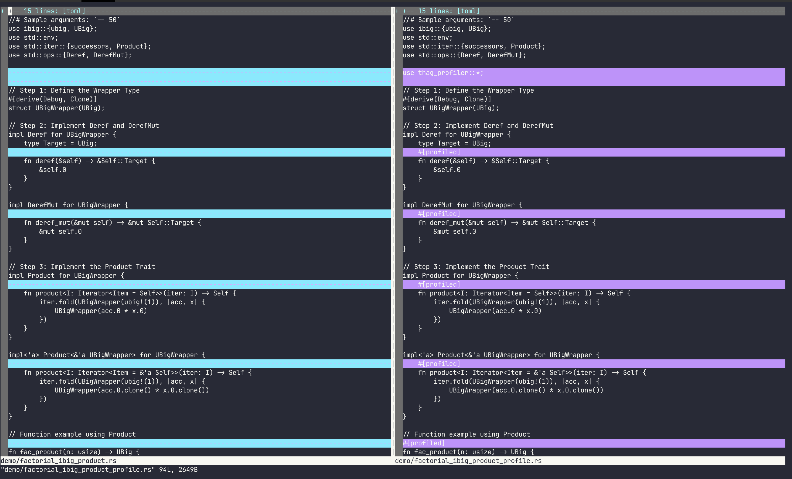
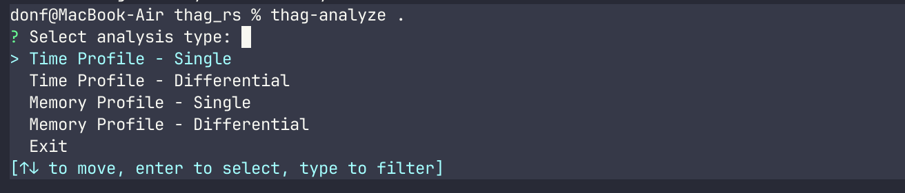

# thag_profiler

An accurate lightweight cross-platform profiling library for Rust applications, offering time and/or memory profiling with minimal boilerplate.

While originally developed as part of the `thag_rs` project, `thag_profiler` functions as a completely independent utility with no dependencies on `thag_rs`.

`thag_profiler` aims to lower the barriers to profiling by offering a quick and easy tool that produces clear and accurate flamegraphs for both synchronous and asynchronous code.

`thag_profiler` provides an `#[enable_profiling]` attribute for your main or other top-level function to be profiled, a `#[profiled]` attribute to profile any function that may be called directly or indirectly from this function, and a combinination of `profile!`and `end!` macros for to profile any desired code sections within this scope.

Each of these items offers a range of options for any combination of time, memory summary and memory detail profiling.
For instance you can start out with default memory summary profiling to detect functions that are memory hotspots, and then use memory detail profiling on those functions or code sections within them get to the root cause.

`thag_profiler` provides an automated instrumentation tool `thag-instrument` that can be used to add the profiling attribute macros to all functions of a module, and a corresponding tool `thag-remove` to remove them after profiling.

`thag_profiler`'s easy-to-use prompted analysis tool, `thag-analyze`, uses two extremely helpful crates:

  - `inquire` to help you select output for analysis and optionally filter out any unwanted functions.

  - `inferno` to display the results in your browser as interactive flamegraphs and flamecharts.

For memory profiles you can also choose to display memory statistics and an allocation size analysis.

## Features

- **Zero-cost abstraction**: No runtime overhead when `thag_profiler`'s profiling features are disabled

- **Execution time profiling**: Low-overhead profiling to highlight hotspots.

- **Accurate memory profiling**: Memory allocations are accurately tracked at line number level and ring-fenced from profiler code so that the latter can't distort the measurements. Allocations may be summarized by function or section, or broken out in detail where desired. Deallocations may also be tracked, but only at a global detail level.

- **Function and section profiling**: Profiling can be applied to any number of specific non-overlapping code sections, down to single instructions.

- **Async support**: Seamlessly works with `tokio` or other async code.

- **Automatic instrumentation**: Tools to quickly bulk add and remove profiling annotations to/from source code without losing comments or formatting.

- **Interactive flamegraphs and flamecharts**: Visualize performance bottlenecks with `inferno` flamegraphs and flamecharts, and easily do before-and-after comparisons using `inferno` differential analysis.

- **Proc macro based**: All instrumentation is provided via proc macros that provide a simple flexible interface, precise control, ring-fencing of profiler code from user code and zero-cost abstractions when profiling features are disabled.

- **Development or release build profiling**: Although `thag_profiler` is focused on the development cycle, it supports profiling release builds, subject to enabling debug information and to any limitations imposed by the `backtrace` crate.

- **Cross-platform**: Works on macOs, Linux and Windows.

## Installation

Add `thag_profiler` to your `Cargo.toml`:

```toml
[dependencies]
# For instrumentation only (default)
thag_profiler = "0.1.0"

# For time profiling only
thag_profiler = { version = "0.1.0", features = ["time_profiling"] }

# OR for comprehensive profiling (memory and optionally time)
thag_profiler = { version = "0.1.0", features = ["full_profiling"] }
```

Install the profiling tools:

```bash
# Install all tools
cargo install thag_profiler --no-default-features --features=tools

# Or install tools individually
cargo install thag_profiler --no-default-features --features=instrument-tool --bin thag-instrument
cargo install thag_profiler --no-default-features --features=instrument-tool --bin thag-remove
cargo install thag_profiler --no-default-features --features=analyze-tool --bin thag-analyze
```

## Quick Start

### 1. Instrument Your Code

#### a. Automatically instrument your code for profiling:

Replace `2021` below with your project's Rust edition:

```bash
thag-instrument 2021 < path/to/your/file.rs > path/to/your/instrumented_file.rs
```

* Ensure your original source is backed up or committed before instrumenting.

* Replace `2021` with your project's Rust edition.

* Do NOT redirect the output to your source file.

* Compare generated code with the original to ensure correctness before overwriting any original code with instrumented code.

Repeat for all modules you want to profile.

####     ... AND / OR ...

#### b. Manually add profiling annotations:

```rust
use thag_profiler::{enable_profiling, profile, profiled};

// Enable profiling for the program.
// To disable it while keeping the instrumentation, you can either
// disable the profiling features in the `thag_profiler` dependency
// or simply specify `#[enable_profiling(no)]`.
#[enable_profiling]
fn main() -> u64 {
    // Function code...
    42
}

// Instrument a function
#[profiled]
fn expensive_calculation() -> u64 {
    // Function code...
    42
}

// Profile a specific section with `profile!` and matching `end!`
#[profiled] // Optional
fn complex_operation() {
    // Some code...

    profile!(expensive_part);
    // Code to profile
    expensive_operation();
    end!(expensive_part);

    // More code...
}

// Profile a specific section of an async function
#[profiled] // Optional
async fn complex_async_operation() {
    // Some code...

    profile!(expensive_part, async_fn);
    // Code to profile
    expensive_operation();
    end!(expensive_part);

    // More code...
}

// Profile the remainder of a function
#[profiled] // Optional
fn complex_operation() {
    // Some code...

    // Must be scoped to end of function
    profile!(rest_of_function, unbounded);
    // All code to end of function will be profiled
}

// A valid identifier may optionally be specified as a string literal:
#[profiled] // Optional
fn complex_operation() {
    // Some code...

    profile!(expensive_part);
    // Code to profile
    expensive_operation();
    end!(expensive_part);

    // More code...
}

// 🚫 INCORRECT:
#[profiled] // Optional
fn complex_operation() {
    // Some code...

    {
        // ⚠️ Unbounded keyword misused here
        profile!(rest_of_block, unbounded); // 🚫
    }   // ⚠️ Profile will be dropped here unknown to allocation tracker

    // ⚠️ The following section profiling may not work correctly due to the above
    profile!(another_section);
    expensive_operation();
    end!(another_section);
}
```

For a section in a profiled async function, it's best to add `async_fn` as a second argument as described further below, to tie the section to the async function instance in the flamegraphs, otherwise the section causes the parent function to appear a second time in the flamegraph without its async identifier, as we have no way to link the two automatically.

### 2. Enable the Profiling Feature

The desired `thag_profiler` feature - `time_profiling` or `full_profiling` - must be enabled at build time in one of two ways:

1. Via a `features` key on the `thag_profiler` dependency in the manifest.

2. Via a command-line `--features` option.

#### In regular Cargo projects

  **1. Cargo.toml only**:

    ```toml
    # Either expose it directly in the dependency:

    [dependencies]
    thag_profiler = { version = "0.1", features = ["full_profiling"] }

    # or via a feature of your own project, with a default:

    ```toml
    [dependencies]
    thag_profiler = "0.1.0"

    [features]
    my_profiling = ["thag_profiler/time_profiling"]
    default = [my_profiling]
    ```

  **OR**

  **2. Cargo.toml and command line**:

    # Either via a feature of your own project as above, but without specifying a default:

    ```toml
    [dependencies]
    thag_profiler = "0.1.0"

    [features]
    my_profiling = ["thag_profiler/time_profiling"]
    ```

    Then run with:
    ```bash
    cargo run --features my_profiling
    ```

    # or directly via the command line:

    ```toml
    [dependencies]
    thag_profiler = "0.1.0"

    Then run with:
    ```bash
    cargo run --features thag_profiler/time_profiling
    ```


#### In scripts run with the `thag` script runner

  This section refers to the `thag_rs` script runner and REPL, aka `thag`, of which `thag_profiler` is
  When using `thag_profiler` in `thag` scripts, for a start you have the same two options as above, except for using a `toml` block in place of a `Cargo.toml`. You also have a third option using only dependency inference and configuration:

  **1. Manifest (toml block) only**:

    ```rust
    # Either expose it directly in the dependency:

    /*[toml]
    [dependencies]
    thag_profiler = { version = "0.1", features = ["time_profiling"] }
    */

    # or via a feature of your own script, with a default:

    ```rust
    /*[toml]
    [dependencies]
    thag_profiler = "0.1.0"

    [features]
    my_profiling = ["thag_profiler/full_profiling"]
    default = [my_profiling]
    */
    ```

  **OR**

  **2. Manifest (toml block) and command line**:

    Sample script configuration:

    ```rust
    # Either via a feature of your own script as above, but without specifying a default:

    /*[toml]
    [dependencies]
    thag_profiler = "0.1.0"

    [features]
    # For time profiling only
    my_profiling = ["thag_profiler/time_profiling"]

    # OR for comprehensive profiling (time + memory)
    my_profiling = ["thag_profiler/full_profiling"]
    */
    ```

    Then run with:

    ```bash
    cargo run bank/mem_prof.rs --features=my_profiling
    ```

    # or directly via the command line:

    ```rust
    /*[toml]
    [dependencies]
    thag_profiler = "0.1.0"
    */
    ```

    Then run with:

    ```bash
    cargo run bank/mem_prof.rs --features thag_profiler/full_profiling
    ```

  **OR**

  **3. Dependency inference and/or default feature configuration**:

    The *dependency* may be omitted and will be inferred either from imports (`use thag_profiler::{enable_profiling, ...};`) or if you use the qualified forms of the macros, e.g. #`[thag_profiler::enable_profiling]`.

    The *feature* may be configured as as a default in `~/.config/thag_rs/config.toml`, which you can conveniently edit via `thag -C`.

    ```toml
    [dependencies.feature_overrides.thag_profiler]
    required_features = ["full_profiling"]
    ```

    Alternatively you can specify it in a toml block in your script, even in combination with dependency inference`:

    ```rust
    /*[toml]
    [features]
    default = ["thag_profiler/full_profiling"]
    */
    ```

  As the examples show, you may pair any dependency option with any feature option, as long as `thag` is able to pick up both the `thag_profiler` dependency itself and the desired `thag_profiler` feature.


### 3. Run Your Application

Ensure that the `thag_profiler` feature you need is enabled by one of the methods discussed above. If using `cargo run` from the command line, and the desired feature is not specified by the manifest, you will need to do so via the `--features` argument of `cargo run`.

If your app is annotated with `#[enable_profiling(runtime)`, specify the environment variable `THAG_PROFILER=[profile_type][,[output_dir][,[debug_level][,memory_detail]]]`*.

*In other words, there are 4 parameters, all optional. Comma separators are required as placeholders but trailing commas may be dropped.

If using `thag` to run a script annotated with `#[enable_profiling(runtime)]` and features not specified in a toml block or configured:

`THAG_PROFILER=both,,announce thag --features=thag_profiler/full_profiling demo/document_pipeline_profile.rs -ft`

If using `thag` to run a script annotated with `#[enable_profiling]` and features specified in a toml block or configured via `thag -C`:

`thag demo/document_pipeline_profile.rs -ft`

### 4. Analyze Results

When you run your application with profiling enabled, `thag_profiler` will generate folded stack files in the current working directory, unless that location is overridden by the second argument of a `THAG_PROFILER` environment variable used in conjunction with `#[enable_profiling(runtime)]`.

Use the included analysis tool to visualize the results:

```bash
thag-analyze <output_dir>
```

This will open an interactive menu to explore your profiling data and display various flamegraphs, flamecharts or simple statistics.

## Detailed Usage

### Manually Instrumenting Code for Profiling

While the `thag-instrument` tool should very quickly provide excellent default instrumentation, this section describes how to fine-tune the profiling to suit your needs.

In addition to enabling the appropriate `thag_profiler` feature, you must enable profiling in your code by adding the `#[enable_profiling]` attribute to the top-level function to be profiled, which is preferably but not necessarily the `main` function.

If using this attribute to annotate any function other than `main`, you need to take extra care. Annotating more than one function with `#[enable_profiling]` is not supported and behavior is undefined in such a case. The same applies to annotating an async function or a descendant of an async function with `#[enable_profiling]`, if this could cause overlap in their execution. It is safer to do the conventional thing and annotate the function in question with `#[profiled` and the `main` function with `#[enable_profiling]`.

**NB:** The `#[enable_profiling]` attribute also profiles the function it annotates, so the `#[profiled]` attribute need not and should not be specified on the same function.

**#[enable_profiling] arguments**

The following optional arguments are available:

- `both`: Specifies both time and memory profiling.

- `memory`: Specifies memory profiling only.

- `time`: Specifies time profiling only.

- `no`: Disables profiling as a convenient alternative to disabling the profiling features of the `thag_profiling` dependency. Unlike disabling the features, this only provides zero-cost abstraction for the current function. However, at runtime the profile instantiation code generated by the other macros will immediately return `None` instead of `Some(Profile)` when profiling is disabled, so the overhead will still be very slight.

- `yes`: (default) Enables profiling according to the feature specified in the `thag_profiler` dependency, which must be either `full_profiling` or `time_profiling`.

- `runtime`: Specifies that a detailed specification will be provided at runtime via the `THAG_PROFILER` environment variable. This is the only option that allows you to influence profiling at runtime. This includes switching profiling off, thus trading the efficiency of zero-cost abstraction for the flexibility of runtime configuration. That being said, the overhead will still be very small, for the reasons stated under the `no` option above.

- `function(...)`: Configures profiling options specific to the current function. Within the parentheses, you can specify any of the arguments that would be accepted by the `#[profiled]` attribute: `time`, `mem_summary`, `mem_detail`, `both`, `global`, `test`

Examples:

```rust
// Basic memory profiling
#[enable_profiling(memory)]
fn main() {
...
}

// Enable memory profiling for the program, together with detailed memory profiling for the function itself.
// Detailed memory profiling will pick up all descendant functions as a matter of course, but you may
// still choose to annotate any of them with #[profiled] for time or memory summary profiling.
#[enable_profiling(memory, function(mem_detail))]
fn process_data() {
...
}

// Runtime global profiling with function-specific time and memory profiling
#[enable_profiling(runtime, function(time, mem_detail))]
fn main() {
...
}
```

**Format of the `THAG_PROFILER` environment variable to be used with `#[enable_profiling(runtime)]`**

The `THAG_PROFILER` environment variable has 4 optional positional comma-separated arguments. If `#[enable_profiling(runtime)]` is
specified but either the environment variable or its first argument is missing, no profiling will be done.

    THAG_PROFILER=[profile_type][,[output_dir][,[debug_level][,memory_detail]]]*.

    *In other words, there are 4 parameters, all optional. Comma separators are required as placeholders but trailing commas may be dropped.

    where `profile_type`           = `both`, `memory`, `time` or `none` (default: none)
          `output_dir` (optional)  = output directory for `.folded` files. The default is the current working directory.
          `debug_level` (optional) = `none` (default) - no debug log
                                     `announce` - display debug log path in user output (`eprintln!()`)
                                     `quiet` - log without displaying location.
                        Debug log output will be written to `std::env::temp_dir()/thag_profiler`
                        with the log name in the format `program_stem-yyyymmdd-HHmmss-debug.log`.
          `detail` (optional, for `memory` or `both` only) = `true` for detailed allocation and deallocation `.folded` file generation,
                                                             otherwise `false` (default).

E.g.:

```bash
THAG_PROFILER=both,$TMPDIR,announce,true cargo run

    Specifies both memory and time profiling, `.folded` files to $TMPDIR, debug log path to be written to user program output, extra `.folded` files for detailed memory allocations and deallocations required.


THAG_PROFILER=time cargo run

    Specifies time profiling only, `.folded` files to current directory, no debug log, no detailed memory files as not applicable to time profiling.


THAG_PROFILER=memory,,quiet thag demo/document_pipeline_profile_minimal.rs  -ft

    Runs `thag` demo script document_pipeline_profile_minimal.rs with forced rebuild (-f) and timings (-t),
    memory profiling only, debug logging without announcing the log file path, and no detailed output `.folded` files.
```

The function annotated with `#[enable_profiling]` will be taken to be the root of the profiling callstack.

```rust
#[thag_profiler::enable_profiling]
fn main() {
    // Your program...
}
```

### Function Profiling with `#[profiled]`

Add the `#[profiled]` attribute to any function you want to profile:

```rust
use thag_profiler::profiled;

// Regular function
#[profiled]
fn expensive_calculation() -> u64 {
    // Function code...
}

// Works with async functions too
#[profiled]
async fn fetch_data() -> Result<String, Error> {
    // Async operations...
}

// Methods in implementations
impl MyStruct {
    #[profiled]
    fn process(&self, data: &[u8]) {
        // Method code...
    }
}
```

#### Attribute Options

The `#[profiled]` attribute macro accepts several arguments that configure how profiling is performed.

##### Usage

```rust
#[profiled]
fn my_function() { ... }

// With arguments
#[profiled(time, mem_detail)]
fn my_memory_intensive_function() { ... }
```

##### Available Arguments

| Argument | Description | Feature Required |
|----------|-------------|------------------|
| `time` | Enables time/performance profiling | `time_profiling` |
| `mem_summary` | Enables basic memory profiling | `full_profiling` |
| `mem_detail` | Enables detailed memory profiling | `full_profiling` |
| `both` | Shorthand to enable both time and memory profiling | `full_profiling` |
| `global` | Uses the global profile type setting | Any profiling feature |
| `test` | Special flag for testing - enables clone of profile for test access | Any profiling feature |

##### Notes

- **Argument Order**: The order of arguments doesn't matter - `#[profiled(time, mem_detail)]` is equivalent to `#[profiled(mem_detail, time)]`.

- **Default Behavior**: If no arguments are provided, the macro defaults to using the global profile type setting.

- **Feature Flags**: Memory-related profiling options require the `full_profiling` feature to be enabled. If only `time_profiling` is enabled, all memory profiling arguments are ignored.

- **Combined Profiling**: Using both `time` and any memory option (e.g., `mem_detail` or `mem_summary`) is equivalent to using `both`.

##### Examples

```rust
// Basic time profiling
#[profiled(time)]
fn time_sensitive_function() { ... }

// Detailed memory profiling
#[profiled(mem_detail)]
fn memory_intensive_function() { ... }

// Both time and memory profiling
#[profiled(both)]
fn complex_function() { ... }

// Or equivalently:
#[profiled(time, mem_summary)]
fn complex_function() { ... }

// Use the global profile type
#[profiled(global)]
fn standard_function() { ... }

// Default - equivalent to global
#[profiled]
fn simple_function() { ... }

// Special case for tests
#[profiled(time, test)]
async fn function_for_testing() { ... }
```

##### Testing Async Functions

For testing async functions with the `#[profiled]` attribute, use one of these approaches:

1. Add the `test` argument: `#[profiled(time, test)]`
2. Add a `_test` suffix to your function name: `async fn my_function_test()`

Both methods allow accessing the profile variable inside async function bodies during tests.

The `#[profiled]` attribute accepts various flags to control profiling behavior:

```rust
// Override the profile type for a specific function
#[profiled(both)]
fn allocating_function() { /* ... */ }
```

#### Order of attributes

If `#[enable_profiling]` is used in conjunction with either `#[tokio::main]` or `#[async_std::main]`, then `#[enable_profiling]` must appear _after_ the other attribute.

#### Interaction with features

If only the `time_profiling` feature is enabled, any memory profiling-specific arguments will be invalid because they depend on the `full_profiling` feature. In this case they will be ignored rather than raise an error.

E.g.:

```Rust
#[cfg(feature = "time_profiling")]
#[profiled(mem_detail)]
```

### Code Section Profiling with `profile!` and `end!`

Section profiling with the `profile!` and `end!` macros allows you to profile hotspots within a function, down to single instructions.

#### Rules

1. **Global constraints take precedence**: Section profiling modes will be overridden by the program defaults set by `#[enable_profiling]`.

2. **Limited integration with functions**: Profiled sections will have ancestors in the callstack, but no children. A function called from within a profiled section will appear in flamegraphs, not as a child of the section but as a child of the parent function and a sibling of the section. This is because profiling hierarchies depend on built-in Rust backtraces, and sections are not a Rust feature but a `thag_profiler` artifact grafted on top of their parent function, and the complexity and overhead of transforming each backtrace to accommodate any sections is not considered worthwhile.

3. **No section nesting or overlaps**: Section profiles should not overlap or be nested in code. This will not be checked, but memory allocations that fall within the scope of more than one section will be attributed to only one of those sections rather than being double-counted.

#### Benefits

1. **Easy to enable/disable profiling globally**: Developers can quickly turn on/off profiling without changing every profile section, since #[enable_profiling] global arguments take precedence.

2. **Clean code organization**: Section profiling clearly shows intent and what *could* be profiled, even if it's currently overridden

3. **Two-layer configuration**: Gives both fine-grained (per-section) and coarse-grained (global) control

4. **Simplicity**: No need for complex conditional logic in each profiling section

#### Format

```Rust
profile!(name[, flag1[, flag2[, ...]]]);
```

Parameters

- **name**: A valid Rust identifier that will be expanded to the variable name of the `Profile` for the section
- **flags**: Optional comma-separated identifiers that control profiling behavior

#### Available Flags

| Flag | Description |
|------|-------------|
| `time` | Enable time profiling for this section |
| `mem_summary` | Enable basic memory allocation tracking |
| `mem_detail` | Enable detailed memory allocation tracking |
| `async_fn` | Mark that this profile is for an async function |
| `unbounded` | This is equivalent to an `end!` macro at the end of the function |

#### Profile Types

The macro automatically determines the type of profiling based on the flags provided:

- **Time only**: When only the `time` flag is present
- **Memory only**: When `mem_summary` or `mem_detail` is present without `time`
- **Both**: When `time` is combined with either `mem_summary` or `mem_detail`

#### Examples

```rust
// Basic time profiling
profile!(calculate_result, time);

// Memory usage summary
profile!(load_data, mem_summary);

// Detailed memory tracking
profile!(process_image, mem_detail);

// Both time and memory profiling
profile!(generate_report, time, mem_detail);

// Async function profiling
profile!(fetch_data, time, async_fn);

// Unbounded memory profile (must be manually ended)
profile!(long_running_task, mem_summary, unbounded);
```

#### Notes

    The macro captures source location information automatically for accurate profiling results.

    Section profiling requires either:

    1. Recommended: an `end!(<identifier>)` macro to drop the   profile outside of user code and to mark the end of the section   so that memory allocations can be
    accurately attributed to the correct section by line number.   This macro invocation must not be outside the normal Rust scope   of the `profile!` macro.

    The identifier must be identical to the one used in the  matching   `profile!` macro call, as it is used to match up  the two.

    or:

    2. An `unbounded` argument to allow the profile to be dropped at   the end of the _function_ and to assist memory profiling. This   is not preferred because:

    a. The profile inevitably gets dropped in user code, leaving it   up to the allocation tracker to identify and filter out its   allocations in the first place. This is not as clean and precise   as using the `end!` mechanism to ring-fence the profiler code,   and thus creates more overhead and greater exposure to any   potential loopholes in the filtering algorithm.

    b. It has limited applicability and is open to misuse. It may   only be used to profile the remainder of a function. For more   limited scopes you must use an `end!` macro.

    The 'unbounded` option may be dropped in future.

### Conditional Profiling

You can conditionally enable profiling based on build configuration:

**1. Attribute macro example**

```rust
// Only apply profiling when a feature is enabled
#[cfg_attr(feature = "my_profile_feature", profiled)]
fn expensive_calculation() { /* ... */ }

// Only profile in debug builds
#[cfg_attr(debug_assertions, profiled)]
fn complex_operation() { /* ... */ }
```


**2. Declarative macro example**

```rust
fn process_data(data: &[u8]) {
    // Only include profiling in debug builds
    #[cfg(debug_assertions)]
    profile!(process_data);

    // Your code here...

    #[cfg(debug_assertions)]
    end!(process_data);

    ...
}
```

## In more depth

### Time Profiling

Time profiling measures the wall-clock time between profile creation and destruction. It has minimal overhead and is suitable for most performance investigations.

### Memory Profiling

`thag_profiler` memory profiling aims to provide a practical and convenient solution to memory profiling that is compatible with async operation.

Memory profiling (available via the `full_profiling` feature) accurately tracks every heap allocation (and for global detailed profiling, deallocation) requested by profiled user code, including reallocations, using a global memory allocator in conjunction with attribute macros to exclude `thag_profiler`'s own code from interfering with the analysis. It uses the official Rust `backtrace` crate to identify the source of the allocation or deallocation request.

#### Memory Profiling Limitations and Considerations

- **Performance Impact**: `thag_profiler` memory profiling introduces significant overhead compared to time profiling. Expect your application to run significantly more slowly when memory profiling is enabled. It's recommended to use memory profiling selectively for occasional health checks and targeted investigations rather than leave it enabled indefinitely.

- **Mitigating Performance Impact with Optional Tracking Threshold Size**: Detailed memory profiling in particular is obviously the slowest profiling option and may be prohibitively slow for some applications.

  To mitigate this, `thag_profiler` provides a `SIZE_TRACKING_THRESHOLD=<bytes>` environment variable allowing you to track only individual allocations that exceed the specified threshold size (default value 0). This is obviously at the cost of accuracy, particularly if your app mainly does allocations below the threshold. To get a good idea of a suitable threshold value, you can first do _detailed_ memory profiling (cancel if you need to once you see significant detailed output being generated in the output directory) and select `Show Allocation Size Distribution` from the `thag-analyze` tool for the profile. This needs to be the detailed allocations `.folded` file, because the normal memory profiling shows aggregated values per function rather than the detailed values being tracked.

  The catch-22 with overriding the default zero threshold is that if there are enough small allocations below the threshold to make a significant difference in profiling speed, those small allocations may themselves be worth investigating. So rather than screen them out, you may well get a better outcome by first identifying hotspots using summary profiling, and then doing very focused detailed profiling only on these, avoiding setting a threshold if at all possible.

- **Custom Global Allocator**: Memory profiling (the optional `full_profiling` feature) uses a custom global allocator to track memory allocations.

  1. This is incompatible with specifying your own global allocator in your application (`#[global_allocator]`), as Rust only allows one global allocator.

  2. **Note about thread-local storage (TLS)**: The profiler is designed to be compatible with code that uses thread-local storage. If you encounter the error "fatal runtime error: the global allocator may not use TLS with destructors", please report it as a bug.

     In older versions of `async_std` (pre-1.10), there were known interactions that could cause this error in certain usage patterns. If you experience issues with a particular async runtime, consider trying alternatives like `smol` or `tokio`.

- **Thread-Safety Considerations**: Memory profiling uses global state protected by mutexes. While this works for most cases, extremely high-concurrency applications may experience contention.

- **Potential Race Conditions in Async Environments**: Unfortunately, profiling code must share a global allocator (the dispatcher) with user code, and use a global variable to indicate to the dispatcher to use the system allocator in place of the default tracking allocator. To avoid a race condition on the global variable in an async environment would require sophisticated locking, complicated by the need to cater for nested profiling code calls. Thread-local storage doesn't work in the presence of thread stealing.

 At the time of writing, the most practical solution found after  extensive experimentation has been to use a simple atomic variable  to manage the current allocator status and to live with the  exposure to the risk of mis-allocation, much as that goes against  Thag's personal style. The mechanism chosen to cater for nested  calls is as simple and hopefully as elegant as possible: if  profiler code finds the current allocator in user mode, it assumes  it's not nested, overrides the setting for the duration and uses a  guard to set it back, otherwise it assumes it's running nested and  does not touch the setting.

 To mitigate against profile code allocations being processed  through the user code allocator, we identify them from their  backtrace and treat them appropriately. The only mitigations  against user allocations being processed through the system  allocator - and thus not recorded - are:

 1. To reduce the number of profiled functions and sections, and if  possible the number of threads, to the practical minimum in the  final stages of profiling, in order to minimise contention.

 2. To check for consistency in the processing of the same  functions and sections over time under different load conditions  and with different amounts of profiled code competing for the  dispatcher.

 Fortunately, results so far have been very consistent, so  contention does not seem to be a significant issue in practice.  However the potential for race conditions is a caveat when memory  profiling in async environments.

- **Complete Allocation Tracking**: All allocations, including those from libraries and dependencies, are tracked and included in profiling data. This provides a comprehensive view of memory usage
   across your entire application stack, revealing hidden costs from dependencies like async runtimes.

Detailed memory profiling will allow you to drill down into these allocations as well as the resulting deallocations.

### Profiling release builds

Although `thag_profiler` is focused on the development cycle, you may wish to do a profiling exercise on a release build. Since `thag_profiler` relies on the `backtrace` crate, see the entry for that crate on `docs.rs` for the backtrace considerations that may affect you. Specifying the following in your `Cargo.toml` or in the toml block of a `thag` script should generally work:

   ```toml
   [profile.release]
   debug = true
   strip = false
   ```

You will also need to provide the features information at build time as described in a previous section.

If you build your app with `#[enable_profiling(runtime)]`, then at runtime you will need to provide the `THAG_PROFILER` environment variable specifying the runtime parameters.

### Windows Memory Profiling

For memory profiling on Windows, your application requires:

1. Debug information in the executable, which can be enabled with:

   ```toml
   [profile.release]
   debug = true
   strip = false
   ```

2. PDB files generated by the build must be distributed alongside the executable.
   These files contain the debug information needed for accurate profiling.

### Async Compatibility

`thag_profiler` supports profiling async code with some considerations:

- **Basic Time Profiling**: Works well with the async runtimes tested including tokio and smol.

- **Memory Profiling with Async**: Memory profiling in async contexts is more complex:
  - Works with tokio and smol for most common patterns
  - Examples of using `thag_profiler` in async contexts may be found at:

    - `https://github.com/durbanlegend/thag_rs/demo/document_pipeline_profile.rs` (tokio)
    - `https://github.com/durbanlegend/thag_rs/demo/smol_chat_server_profile.rs` (smol)
    - `https://github.com/durbanlegend/thag_rs/demo/flume_async_profile.rs` (async-std)
  - For best results in async code, use explicit section profiling with `profile!(<section_name>, async)`

### Implementation Details

`thag_profiler` uses several internal mechanisms to track profiling data:

- **Tracking allocations by line number of origin**: Memory profiling attributes allocations to the correct point of origin ("allocation site"), even in async contexts, by matching their file, function and line number of origin with the file, function and line number ranges of the profiles generated by the `thag_profiler` macros.

- **Thread safety**: The profiler uses atomic operations and mutex-protected shared state to coordinate profiling across threads.

- **Guard objects**: TaskGuard objects help manage the lifetime of profiling tasks and ensure proper cleanup when tasks complete.

- **Profile code ring-fencing**: The profiler carefully isolates its own allocations and operations from user code through the use of a dual-allocator system. This ensures that profiling overhead
  doesn't contaminate the results, providing clean separation between the measurement apparatus and the code being measured.

Note that deallocations are not reported for normal memory profiling, as they invite a fruitless attempt to identify memory leaks by matching them up by function against the allocations, whereas the deallocations are often done by a parent function. However, deallocations are reported for detailed memory profiling in order to give a complete picture, so this is a better tool for identifying memory leaks, although still not a walk in the park.

#### Profiling data recording

The recording takes two forms:

a. For regular memory profiling, the allocations are accumulated to a mutex-protected collection with the key of the identified `task_id` which in turn is associated with a `Profile` that created it before the execution of the function began. When the function completes execution the `Profile` goes out of scope and is automatically dropped, and its `drop` trait method retrieves all the accumulated allocations for the associated `task_id` and writes them to the `-memory.folded` file.

Time profiling is simpler: all that's needed is to record the duration between the activation and dropping of the profile.

In both cases, since the metrics for the function are measured over the lifetime of its profile instance, `thag_profiler` takes care to ensure that the profile lifetime coincides as closely as possible with the lifetime of the function, in order to ensure accurate measurement.

b. For detailed memory profiling, allocations and deallocations alike are not accumulated or even tracked back to a `Profile`, but immediately written with a lightly tidied-up stack to the `-memory_detail.folded` and `-memory_detail_dealloc.folded` files respectively.

Being the default, the task-aware allocator is automatically used for user code and must not be used for profiler code.

To avoid getting caught up in the default mechanism and polluting the user allocation data with its own allocations, all of the profiler's own code that runs during memory profiling execution is passed directly to the untracked System allocator in a closure or function via a `with_sys_alloc()` function (`pub fn with_sys_alloc<T, F: FnOnce() -> T>(f: F) -> T`).

### Profile Output

Profiles generate "folded" stack traces in the output directory by default:

- `your_program-<yyyymmdd>-<hhmmss>.folded`: Time profiling data

- `your_program-<yyyymmdd>-<hhmmss>-memory.folded`: Memory profiling data (if enabled)

These files can be visualized with the included analyzer or with tools like [Inferno](https://github.com/jonhoo/inferno).


### Profiling Tools

`thag_profiler` includes three command-line tools for working with profiles.

***Important notice:***

By using the tools, you agree to the license terms and take full responsibility for any consequences. Please take care to back up and protect your code before instrumenting or removing instrumentation.
Take care not to overwrite your code when using the instrumenting tools unless you have a backup.

[License reminder](../assets/dont_make_me_tap_the_sign.jpg)


#### Instrumentation: thag-instrument and thag-remove

Automatically add or remove profiling attributes to/from code, outputting to a different file.

These tools aim to be lossless, i.e. preserving comments and formatting intact. For this purpose
they rely on `rust-analyzer`'s `ra_ap_syntax` and `ra-ap-rustc_lexer` crates rather than `syn` and `quote`.

Input is from `stdin` and output is to `stdout`.

***NB:*** always direct output to a different file.

Replace `2021` with your project's Rust edition (2015, 2018, 2021, 2024) as required by the `rust_analyzer` crates:

***thag-instrument:*** Add profiling attributes to code
```bash
thag-instrument 2021 < path/to/your/file.rs > path/to/your/instrumented_file.rs
```

***thag-remove:*** Remove profiling attributes from code
```bash
thag-remove 2021 < path/to/your/instrumented_file.rs > path/to/your/de-instrumented_file.rs
```

* Ensure your original source is safely backed up or committed before instrumenting.

* Replace `2021` with your project's Rust edition.

* Do NOT redirect the output back to your source file in the same command.

* In the case of `thag-remove`, you may need to remove the relevant imports manually.
`thag-remove` may leave the occasional trailing space and one or two blank lines at the very top of the file.

* Compare the original and instrumented files to ensure correctness, especially if
you're using a custom edition.

  E.g.  Comparing before and after with `vimdiff`:

    ```
    vimdiff demo/factorial_ibig_product.rs demo/factorial_ibig_product_profile.rs
    ```

    

    If you're profiling a project source file, at this point you'd want to replace the uninstrumented code with the instrumented version.


Repeat for all modules you want to profile.

#### 3. Analysis: thag-analyze

Interactive analysis of profiling results:

```bash
thag-analyze
```


## Profile Analysis Features

The analyzer provides:

**1. Statistical Summary**: Shows function calls, total time, average time

**2. Interactive Flamegraphs and Flamecharts**: Visual representation of performance data, both cumulative and detailed

**3. Differential Analysis**: Compare before/after optimizations (cumulative) using `inferno` differential flamegraphs module.

**4. Memory Allocation Tracking**: Identify memory usage patterns. This metric, when observed at the detail level, is useful for deciding on an allocation size threshold if you need to set one for profiling performance.

### Flamegraphs and Flamecharts

Cumulative flamegraphs and detailed flamecharts provide an intuitive interactive visualization of your profiling data. The wider a function appears, the more time (or allocated / deallocated memory) it represents relative to the total for the execution.

Flamegraphs and flamecharts are interactive SVGs that allow you to:

- Zoom in on specific functions

- Hover over functions to see detailed information

- Search for specific functions

- Compare before/after optimizations


You can interact with the above example [here](../assets/flamechart_time_20250312-081119.svg).

`thag_profiler` uses the `inferno` crate to generate flamegraphs and flamecharts.
For the execution timeline, the analysis tool allows you to choose the `inferno` color scheme to use.
For memory flamegraphs and flamecharts, it adheres to `inferno`'s memory-optimized color scheme.


 ### Flamegraphs vs. Flamecharts

`thag_profiler` can generate both flamegraphs and flamecharts:

- **Flamegraphs** aggregate all executions of a function into one, making them ideal for identifying which functions consume the most resources overall. Use flamegraphs when you want to identify your application's hottest functions regardless of when they occur. Flamegraphs organize functions alphabetically, so unlike flamecharts there is no deep significance to the horizontal sequence of items - it is only the width and the parent-child relationships that are important.

- **Flamecharts** organize functions chronologically, showing the sequence of operations over time. They're particularly valuable for:
  - Understanding the progression of your application's execution
  - Identifying patterns in memory allocation/deallocation
  - Seeing how different phases of your application behave

Note that `inferno` will still aggregate consecutive entries with the same key into a single bar. So if a profiled function or section `f` is called repeatedly in a loop in a synchronous program, these executions will be shown as one. In an async environment, the consecutive entries for `f` may be arbitrarily interleaved with entries written by unrelated asynchronous profiles being dropped, e.g. `f,f,f,a,f,f,b,c,f`. This will cause `inferno` to group the consecutive entries for `f` in the arbitrary consecutive groups thus created. This does not affect the correctness of the attributions to `f`, but be aware that the distribution may well be arbitrarily misrepresented. We could consider working around this, e.g. with a naming trick, but in the async scenario when multiple instances of `f` are running concurrently, `thag_profiler` has no way to tell them apart anyway, and resorts to arbitrarily attributing the allocation to the most recently instantiated active one of them, falling back to the closest matching ancestor as a last resort.

For time profiling, flamecharts show when each function executed relative to others. For regular memory profiling, they are less significant because all allocations for a function are shown as at the end of execution of the function, because it is at this point that `thag_profiler` `Profile` object generated for that execution of the function is dropped and its `drop` method writes the function's accumulated allocations to the `-memory.folded` file.
For detailed memory profiling, they are again more significant as they show when the allocations (for `-memory_detail.folded` and deallocations (for `-memory_detail_dealloc.folded`) actually occurred, as they are recorded immediately the allocation or deallocation requests are received and identified by the global allocator.

Choose flamegraphs for a high-level view of resource usage and flamecharts for detailed analysis of execution flow.

## Best Practices

**1. Profile representative workloads**: Make sure your test cases represent real-world usage

**2. Focus on hot paths**: Look for the widest blocks in your flamechart - these are your performance bottlenecks

**3. Compare before/after**: Always compare profiles before and after optimization

**4. Watch for memory bloat**: Use memory profiling to identify excessive allocations

**5. Verify changes**: Always verify automated changes with a diff tool

**6. Don't run with option `both` for serious time profiling, as the memory profiling overhead will tend to distort the relative execution times of the functions and sections**

**7.Async Function Profiling**: For accurate callstack representation in async contexts, use the `async_fn` parameter when manually creating profile sections within async functions:

```rust
async fn fetch_data() {
    // Tell the profiler this section is within an async function
    profile!(database_query, async_fn);

    // Async operations...
    let result = query_database().await;

    end!(database_query);
}
```

This ensures the profile correctly associates the section with its async parent function in the profiling output. Without this parameter, the section might be incorrectly duplicated in memory
profiling output.

 ### Memory Profiling Best Practices

When using memory profiling, follow these guidelines for the most accurate results:

```rust
// Use attribute macros for consistent memory tracking
#[enable_profiling]
#[profiled]
fn main() {
    // Run your application...
    memory_intensive_function();
}

#[profiled]
fn memory_intensive_function() {
    // Memory will be automatically tracked for this function
    // and attributed to it in the profiling output

    // Create explicit scope for allocations to ensure
    // they're properly tracked and released
    {
        let data = vec![0u8; 1_000_000];
        process_data(&data);
    } // Memory is released here and recorded
}

For the most accurate memory profiling:

1. Use attribute macros consistently across your codebase
2. Create clear scopes for memory-intensive operations
3. Use thag-analyze's filtering to focus on relevant parts of your application
4. Consider enabling detailed memory profiling for full allocation visibility

## Testing with Profiled Code

When writing tests that use profiled functions, it's recommended to use a serialization mechanism. The `#[enable_profiling]` attribute and the current tests use the `thag_profiler::PROFILING_MUTEX` to ensure that only one instance runs at a time for thread safety:

TODO update:
```rust
use serial_test::serial;

#[test]
#[serial]
fn test_profiled_function() {
    // Tests using profiled functions
}
```

This is important because `thag_profiler` maintains some global state that isn't thread-safe (although this shouldn't affect async profiling per se).

## Troubleshooting

### Common Issues

**1. Missing profile output**: Ensure profiling is enabled and you have write permissions in the current directory.

Ensure your code is compiled with the `debug` option while profiling. E.g. in release mode:

```toml
[profile.release]
debug = true
strip = false
```

Ensure that unbounded section profiles do not go out of scope before the end of the current _function_.

Ensure that bounded section profiles do not go out of scope before the `end!` macro.

**2. Inaccurate profile output**: Ensure you have no nested or overlapping profile sections.

**3. Test failures**: Profiled tests must use serialization

**4. Performance impact**: Memory profiling adds significant overhead.

Consider using SIZE_TRACKING_THRESHOLD=n as discussed above to ignore small allocations of integer `n` bytes or smaller.

**5. File redirect issues**: Never redirect output from the instrumentation tools back to the input file

### Inspecting Profile Files

The folded stack files are human-readable:

```bash
head your_executable-<yyyymmdd>-<hhmmss>.folded
```

### Terminology

#### Ancestor and descendant functions
An **ancestor function** of a function `f` means any function that may directly or indirectly call function `f` during execution.

A **descendant function** of a function `f` means any function that may be called directly or indirectly by function `f` during execution.

## License

SPDX-License-Identifier: Apache-2.0 OR MIT

Licensed under either of

    Apache License, Version 2.0 (LICENSE-APACHE or http://www.apache.org/licenses/LICENSE-2.0)

or

    MIT license (LICENSE-MIT or http://opensource.org/licenses/MIT)

as you prefer.

## Contributing

Contributions will be considered (under MIT/Apache 2 license) if they align with the aims of the project.
