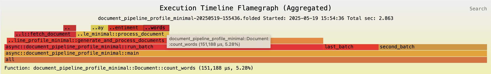

<figure style="width: 100%; padding: 0; margin: 20px 0;">
  <object type="image/svg+xml" data="../docs/thag_profiler/assets/flamechart_hot_20250519-155436.svg" style="width: 100%; max-height: 500px; display: block;">
    <!-- Fallback for browsers that don't support SVG in object -->
    
  </object>
  <figcaption>Time profile in <code>inferno</code> "hot" color scheme (interactive). Click on any bar to drill down. <a href="https://durbanlegend.github.io/thag_rs/thag_profiler/assets/flamechart_hot_20250519-155436.svg">Open in browser</a></figcaption>
</figure>

---

